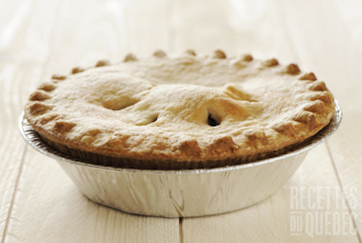

## Tourtière (Meat Pie) - Chicken

### Ingredients

- 4 chicken legs with skin and add extra skin from the breasts to add more fat. 
	- If you only have 2 chicken legs, add the breast and 1/4 lard to have about 20% fat ratio. 
- 3-4 potatoes, cubes
- 2 cups of bone broth
- Celery, cubes
- Onions, cubes
- Spices mixtures: 
	- all spices
	- nutmeg
	- cloves
	- thymes
	- salt
	- pepper
	- bay leaves
- Pie crusts
- 1 beaten egg in a separate bowl (optional)

### Instructions

1. Grind the chicken into fine ground meat. 
2. skin the potatoes and cut into cubes.
2. Cut the onions, and celery in cubes. 
3. Boil the potatoes, drain the water and mashed it. 
4. In the food processor, add the onions, celery and ground chicken. The meat should be a paté.
5. Put the paté chicken in the frying pan. Add 1 to 2 cups of broth. Enough to cover the frying pan (about half inch deep). 
6. When the meat is no longer pink, add mashed potatoes till the paté become creamy. 
7. Add the spice mixtures. 
8. Add more broth. Enough to cover the meat and mix well. 
9. While cooking, bring it to a boil at medium heat. Then bring the temperature down at low heat. Cover the frying pan. Cook at low for about 45 minutes. 
10. Adjust the spices to taste. Then boil the liquid off until desire consistency (need to have a paté fit for a pie, so not runny). 
11. Preheated the oven at 400F.
12. Put the meat into a pie crust. 
13. Either score some design into your top of your pie to make some holes in order to let the steam escape. 
14. Brushed the beaten egg on the top of the pie to give a shine. 
15. Cook the pie at 400F for about 15 minutes. 
16. Change the oven temperature at 350F and let it cook for 50 minutes. 
17. Take the pie out and let it cool (about 20 minutes). 

Serve and enjoy
