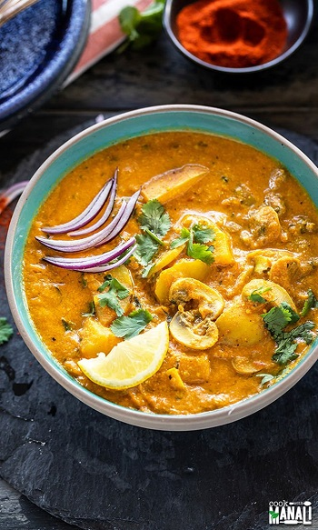

## Aloo Mushroom Masala

[Original Recipe from Cook with Manali](https://www.cookwithmanali.com/instant-pot-aloo-mushroom-masala/#wprm-recipe-container-42139)

** Prep time: 10 minutes || Cook time: 25 minutes || Total time: 35 minutes || Serving: 2 || Rating 10/10 **

### Ingredients

- 1/3 cup raw cashews
- 1 cup of sliced mushrooms
- 1/2 cup of green peas (optional)
- 1 cup of dried giant lima beans (soaked overnight and boiled for 1 hour) 
- 1 medium onion, chopped
- 1 inch ginger, chopped
- 3-4 large garlic cloves, chopped
- 3 medium tomatoes, pureed or canned
- 1.5 tablespoon oil
- 1 cup broth
- 3/4 teaspoon coriander powder
- 1/4 teaspoon garam masala
- 1/2 teaspoon smoked paprika
- 1/4 teaspoon turmeric powder
- 1/4 teaspoon red chili powder/cayenne pepper
- 1/4 teaspoon sugar, maple syrup or honey (optional)
- salt (to taste(to taste)
- 1-2 tablespoons chopped cilantro
- lemon juice (to taste) 

### Instructions

1. Soak 1/3 cup of cashews in hot water for 10 to 15 minutes. Then puree in a blender to a paste along with 1/4 cup water. Set it aside.

2. Press the saute button on the Instant Pot. Once it displays hot, add the oil and then add the chopped onion, ginger and garlic. Cook for around 3 minutes or until the onions are soft and light golden in color.

3. Add the pureed tomatoes. Stir to incorporate.

4. Add coriander powder, garam masala, smoked paprika, turmeric, chili powder, sugar and salt. Stir to combine.

5. Add the sliced mushrooms and lima beans. Toss to combine with the masala. Add in 1 cup of broth.

6. Close the pot with the lid and press the manual or pressure cook button. Cook on high pressure for 2 mins, with the pressure valve in the sealing position. Let the pressure release naturally for 2 minutes and then do a quick pressure release.

7. Open the pot and press the saute button again. Stir in the prepared cashew paste and mix.

8. Add the cilantro. Simmer the curry for 2 to 3 minutes, the curry will thicken.

9. Add lemon juice, a little at a time, and mix. 

10. Serve mushroom curry over rice or quinoa!

Notes: 

- Curry will thicken as it cools down as there are cashews in there. So do add 1 cup water, it might seem like a lot but its not.
- I cooked on high pressure for 2 minutes because I wanted a bite to my mushrooms. If you want them soft, do 4 to 5 minutes on high pressure.

_Tags: vegan, gluten-free, dairy-free, 30 minutes, instant pot, pressure cooker, lunch, dinner, indian, main_