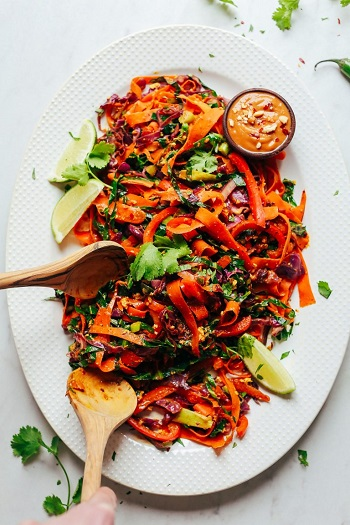

## Noodle-Free Pad Thai

[Original Recipe from Minimalist Baker](https://minimalistbaker.com/noodle-free-pad-thai-30-minutes/)

** Prep time: 15 minutes || Cook time: 15 minutes || Serving: 2 || Rating 10/10 **

### Ingredients

VEGGIES

- 1 Tbsp sesame oil
- 1 medium serrano pepper (seeds + stem removed, thinly sliced // omit for less heat)
- 1 small bundle green onions (ends removed + thinly sliced)
- 2 cups thinly sliced red cabbage
- 2 medium red bell pepper (cored and thinly sliced lengthwise)
- 2 Tbsp coconut aminos (or tamari or soy sauce if not gluten free)
- 2 cups carrots (peeled and ribboned with a vegetable peeler)
- 1 head of collard greens leaves (large stems removed, stacked + thinly sliced)
- 1/2 tsp freshly grated ginger (optional)
- 1/2 tsp freshly grated turmeric (optional)

SAUCE

- 2 1/2 Tbsp nut butter (almond butter, peanut butter, sunflower seed butter, etc.)
- 3 Tbsp lemon juice
- 3 1/2 Tbsp coconut aminos (or tamari if not GF)
- 1/2 tsp red pepper flake
- 1 1/2 Tbsp maple syrup

PROTEIN

- tofu, chicken, tempeh, beef etc.

####
If you add Tofu: 

- 1/2 cup extra-firm tofu (excess liquid pressed out, crumbled with a fork)
- 1 Tbsp coconut aminos (or tamari if not GF)
- 1 tsp chili garlic sauce (or 1/8 tsp red pepper flake)
- 1/4 tsp ground turmeric (optional)

FOR SERVING optional

- Fresh cilantro
- Crushed peanuts
- Red pepper flake

### Instructions

1. Prepare your protein source
    - If serving with tofu: Add tofu to a mixing bowl and season with coconut aminos, pepper flake, and turmeric. Set aside.
    - If serving with meat: cut into 1 inch pieces and set aside.
2. Add all sauce ingredients to a mixing bowl. Set aside.
3. Heat a large skillet over medium heat. Once hot, add oil (or water), pepper, onions, cabbage, bell pepper, and 1 Tbsp coconut aminos. Cook for 3 minutes, stirring frequently.
4. Add carrots Cook for 2 minutes, stirring frequently.
5. Add protein to a corner of the pan and sauté until slightly browned, stirring frequently - about 3-5 minutes.
6. Add collard greens and 1 Tbsp the coconut aminos for the veggies and stir. Sauté for 2 minutes. 
7. Add Pad Thai sauce and freshly grated ginger and turmeric.
8. Sauté over medium heat until warmed through and collards are slightly wilted - about 3 minutes - stirring frequently.
9. Taste and adjust flavor of dish as needed.

Serve as is or over quinoa or even add some hemp seeds.

_Tags: vegan, gluten-free, dairy-free, paleo, 1 hour, indian, vegetables, lunch, dinner, main_