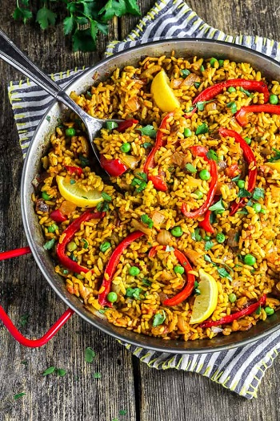

## Spanish Vegan Paella

[Original Recipe by Thugs Kitchen: The official Cookbook] 

[Picture by Melissa Huggins](https://veganhuggs.com/vegetable-paella-recipe/)

** Total time: 50 minutes || Serving: 4 || Rating 9/10 **

### Ingredients

- 2 1/2 cups broth
- 3/4 cup dry white wine (can replace with broth instead)
- Pinch of saffron threads or turmeric will work as well (optional)
- 1 tablespoon olive oil 
- 1 cup of chopped yellow onion
- 3/4 cup of chopped mushrooms
- 2 larges tomatoes, chopped
- 1/4 teaspoon salt
- 1 cup soaked+cooked baby lima/cannelini beans (1/3 cup of dry beans)
- 3 cloves garlic, minced
- 1 1/2 teaspoons smoked paprika
- 1 cup short-grain rice
- 1 1/2 cups asparagus (or green beans), cut in 2 inch strips
- 1-2 red/orange/yellow bell pepper, roasted, cut in strips
- 1 can (14 oz) water-packed artichoke hearts, drained, rinsed, and chopped
- 2 tablespoons lemon juice
- Paprika, for garnish

### Instructions

- Steep the Saffron in Broth
	1. In a medium pot, combine the broth and wine and warm up to a simmer over medium-low heat. 
	2. Add the saffron, cover and turn off the heat. Let the saffron steep.
####
- Cook the Paella
	1. In a skillet pan, warm up the olive oil over medium heat. 
	2. Add the onions and sauté until they become translucent (about 3 minutes). 
	3. Add the mushrooms, tomatoes and salt. Sauté until most of the liquid has evaporated from the pan (about 4-5 minutes).
	4. Add the lima beans, asparagus, artichoke hearts, garlic and smoked paprika. Mix and sauté for 30 seconds.
	5. Add the rice (cook it long enough to make sure it gets mixed with all the veggies). Mix well quickly. 
	6. Fish out the saffron threads from the broth and toss them. 
	7. Pour the warm broth over the rice mixture, stir in and scrape down the sides. 
	8. Bring the pan to a strong simmer, cover and reduce the heat to medium-low. Let it simmer until all the water is absorbed in the pan (about 30-40 minutes). 
	9. Drizzle with lemon juice and add paprika over the top. 

