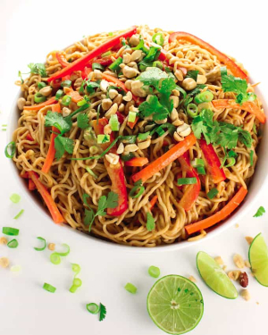

## Peanut Noodles

[From the Fuss-Free Vegan Cookbook](https://www.amazon.ca/s?k=fuss+free+vegan&crid=2QXY700P3THUW&sprefix=fuss+fr%2Caps%2C-1&ref=nb_sb_ss_i_1_6)

** Prep time: 10 minutes || Cook time: 5 minutes || Serving: 4 || Rating X/10 **

### Ingredients

**Sauce**

- 1/2 cup smooth or crunchy nut butter (peanut, almond, hazelnut, or sunflower)
- 1/2 cup water
- 3 Tbsp soy sauce
- 2 cloves garlic, minced
- 2 Tbsp lime or lemon juice
- 1 Tbsp maple syrup
- 1-inch piece of ginger (to be grated later)
- 2 tsp sriracha
- 1 tsp sesame oil

**Noodles**

- 1 package (6 oz) chow mein noodles
- 1 Tbsp oil
- 1 red bell pepper, chopped
- 1 medium carrot, cut into matchsticks
- 2 green onions, chopped
- 1/4 cut peanuts (substitute as desired), chopped
- handful of cilantro, chopped

### Instructions

1. Mix together all the ingredients for the sauce, set aside
1. Prepare the noodles according to the package directions.
1. Heat the oil in a frying pan over medium heat.
1. Add the carrots, and bell peppers, and fry for 2-3 minutes.
1. Stir in the green onions, and continue to stir-fry for an additional 2-3 minutes.
1. Add the drained noodles, and the sauce. Mix well, and garnish with the peanuts and cilantro
