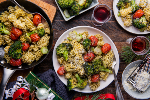

## Pesto Radiatore with Oven-Roasted Tomatoes & Broccoli

[Original Recipe by goodfood]

** Prep time: 15 minutes || Cook time: 20 minutes || Serving: 2 || Rating 9.5/10 **

### Ingredients

- 225g Fresh radiatore, fusilli or rotini
- 25g cheeze or Parmesan cheese, grated
- 280-300g Cherry tomatoes, 
- 2 Garlic cloves, minced
- 1 shallot (or sweet onion), diced
- 1 Broccoli, bite-size florets and steam cut into rounds
- 7.5g Tuscan Sun spice blend 
	- (garlic, red bell pepper, dried black olives, basil, oregano, salt, parsley, lemon, sunflower oil, black pepper)
- 30-60g [basil pesto](../../sauces/basil_pesto/)

### Instructions

1. Preheat the oven to 450°F. Bring a large pot of salted water to a boil. Cut the broccoli head into bite-size florets; peel and slice the broccoli stem into rounds, discarding the bottom inch. On a lined sheet pan, toss the broccoli florets and stems with a drizzle of oil; season with ⅓ of the spice blend and S&P. Arrange in a single, even layer and roast in the oven, 6 to 8 minutes, until beginning to soften. 
2. While the broccoli roasts, in a medium bowl, toss the cherry tomatoes with a drizzle of oil; season with ½ the remaining spice blend and S&P. Remove the sheet pan of broccoli from the oven; flip the broccoli and arrange on ⅔ of the sheet pan in a single, even layer. To the remaining ⅓ of the pan, add the seasoned cherry tomatoes. Return to the oven and roast, 10 to 12 minutes, until the cherry tomatoes begin to burst and the broccoli is tender when pierced with a fork. 
3. While the broccoli and cherry tomatoes roast, add the pasta to the pot of boiling water; stir gently to separate. Boil, 2 to 4 minutes, until al dente (still slightly firm to the bite). Reserving ½ cup cooking water (double for 4 portions), drain the pasta thoroughly. Toss with a drizzle of oil to prevent sticking and set aside in a warm spot. 
4. Make the pesto sauce
In a large pan, heat a drizzle of olive oil on medium-high. Add the garlic and shallot; sauté, stirring frequently, 1 to 2 minutes, until fragrant. Add the pesto, reserved cooking water and 1 tbsp butter (double for 4 portions); season with the remaining spice blend and S&P. Cook, stirring frequently, 1 to 2 minutes, until the sauce is heated through.
5.Combine pasta & serve
To the pan of pesto sauce, add the cooked pasta, roasted cherry tomatoes, ½ the roasted broccoli and ½ the Grana Padano; season with S&P to taste. Mix thoroughly to combine. Divide the finished pasta between your plates. Garnish with the remaining Grana Padano. Serve the remaining roasted broccoli on the side. Bon appétit!

