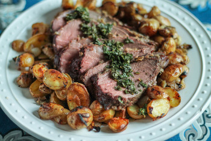

## Roasted Leg of Lamb

[Original Picture from The Kittchen](https://thekittchen.com/roast-lamb-with-mint-sauce/)

** Prep time: 10 minutes || Cook time: 60 minutes || Serving: 6 || Rating 10/10 **

### Ingredients

- 1 semi-boneless Leg of Lamb (6-8 lbs)
- 4 garlic cloves, thin slivers

** Dressing Seasoning **

- 1 teaspoon of rosemary
- 3 tablespoons olive oil
- salt and pepper

** Mint Sauce **

- 1/2 cup of fresh mint leaves, minced
- 1/4 cup of balsamic vinegar
- 2 tablespoon of sugar (e.g. cane sugar or palm sugar)

### Instructions

1. In a small bowl, mix the dressing sauce: rosemary, olive oil, salt and pepper. 
2. In a small serving bowl, mix the mint sauce: mint leaves, balsamic vinegar and sugar.
3. Cut slits in the roast with the tip of a paring knife. Poke the garlic slivers inside.
4. Brush the dressing seasoning onto all the surfaces of the meat. 
5. Place the leg in a roasting pan fitted with a flat rack. Pour about 1/2 cup of water into the bottom of the roasting pan. 
6. Preheated the oven to 450F. 
7. Roasted the lamb for 10 minutes. Turn the leg over and roast for another 10 minutes. 
8. Lower the oven temperature to 325F. Turn the leg over again, and continue roasting, turning the leg every 20 minutes until the thermometer inserted in several locations read 130F (for medium meat). It should cook for about 1 hour to 1h20. 
9. When cook, take the meat out of the oven and let it sit for 15 minutes. 
10. on a cutting board, cut the roast into slices and put it on a serving plate. 

Add the mint sauce on top of your slices of meat and enjoy the meal. 
