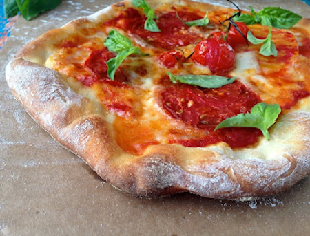

## Rustic Italian Pizza

[Original Recipe by Florentina](https://ciaoflorentina.com/rustic-pizza-dough-recipe/)

** Prep time: 10 minutes || Cook time: 15 minutes || Serving: 4 || Rating X/10 **

### Ingredients

- [Rustic Italian pizza dough](../breads/italian_pizza_dough.md)

** toppings: **

- Caramelized onions
- Arrabiata Sauce
- Heirloom Tomatoes
- Fresh Basil
- Green Onions
- Smoked Mozzarella Cheese
- Sauteed Mushrooms
- Ricotta Meatballs

### Instructions
1. Preheat the pizza stone for 45 minutes at 400F.
2. Sprinkle the counter with a little bit of flour, take the pizza dough and press down on it with your fingers until you have 1/2" thick circle or oval. Using your fists and knuckles start stretching the dough until 10" in diameter making sure not to tear it.
3. Dust your pizza peel (or a piece of cardboard) very well with semolina flour or corn meal and set your pizza dough on it making sure it slides easily when moved. Pour 2-3 tablespoons of the pizza sauce in the centre and spread it around with the back of a spoon leaving 1 inch of space at the edges and making sure not to get any on the peel. 
4. Sprinkle the mozzarella and add your favourite toppings. 
	- Don't add too many toppings, keep in mind this is a thin crust and a couple of toppings will suffice.
5. Gently slide the pie on the preheated pizza stone and bake for 5 to 7 minutes or until golden brown on the edges. 
6. Turn the broiler to maximum, and allow the pizza to develop a nice char.
7. Remove from the oven and sprinkle with the basil and freshly grated parmigiano reggianno. Allow to rest for a few minute for the cheese to set.

### Notes
- Make sure to preheat your oven with the pizza stone on the top rack for at least 45 minutes, and finish cooking the pizza under the broiler for a nice charred touch.
- If topping with heirloom tomato slices, make sure to use the firm ones, otherwise the pizza would be watery. Thin firm slices is what you want.
