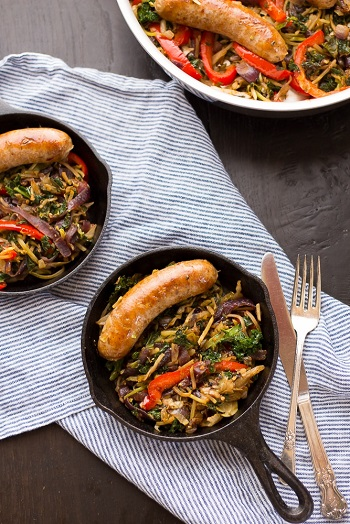

## Sausage and Slaw Skillet

[Original Recipe from Megan: Fox and Briar](https://www.foxandbriar.com/one-pot-paleo-sausage-slaw-skillet/)

** Prep time: 5 minutes || Cook time: 25 minutes || Total time: 30 minutes ||Serving: 4 || Rating 9.5/10 **

### Ingredients

- 4 Italian Sausage Links or ground sausage (Uncooked)
- 1 Tablespoon olive oil (or oil of choice)
- 1 large onion, sliced
- 1-2 red bell pepper, sliced
- 6 cups of slaw
- 4 garlic cloves, minced
- 1\2 teaspoon paprika
- 1\2 teaspoon dried oregano
- teaspoon red pepper flakes, to taste (optional)
- salt to taste
- pepper to taste

### Instructions

#### Slaw
 - large stems removed, stacked, thinly sliced Green collard/Kale/Spinach
 - thinly sliced cabbage (nappa, red cabbage etc.)
 - end removed and thinly sliced brussel sprouts
 - sliced/into small floret brocoli
 - sliced/into small floret Cauliflower (optional)
 
#### Sausage
1. Prepare the sausage: 
	- ground sausage: make little flat meatball 
	- sausage with casting: slice the sausage with the thickness you want. 
2. In a high sided saute pan, add enough water to submerge the sausages. Bring the water to a boil and then turn off the heat. 
3. Add the sausages to the water and cover. Allow to sit for 7 minutes. 
4. Drain water and then brown sausages. You may need to add a tiny bit of oil to the pan if they are sticking.
5. Once sausages are browned and reach an internal temperature of 165 degrees, remove from pan. 

#### Cooking
1. Reduce heat to medium and add 1 tablespoon of oil to the pan. 
2. Add onions and season with a little salt. Cook until for about 2 minutes, 
3. Add bell pepper and cook for another two minutes, until onion and bell pepper have softened. 
4. Add garlic and spices, cook for about 30 seconds, until fragrant.
5. Add the slaw to the pan. Cook and stir in until everything is combined and slaw is wilted (about 5 minutes)
6. Season to taste.
7. Add the sausages back to the pan, stirring slaw as needed, until sausages are warmed. 

Enjoy
