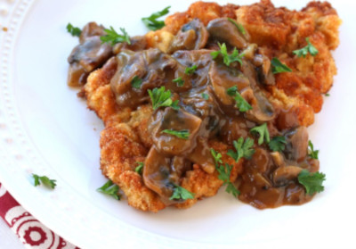
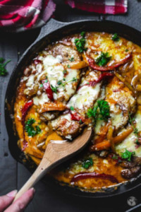

## Authentc German Schnitzel

[Original Recipe from The Daring Gourmet](https://www.daringgourmet.com/authentic-german-jagerschnitzel-hunter-schnitzel-with-mushroom-gravy/)

** Prep time: 20 minutes || Cook time: 25 minutes || Serving: 4 || Rating X/10 **

### Ingredients

- 4 boneless pork steaks/chops, chicken breast, or veal steak
- olive oil
- 1/2 cup all-purpose flour combined with 1 teaspoon salt
- 2 large eggs, lightly beaten
- 3/4 cup plain breadcrumbs
- salt and freshly ground black pepper

** Options for accompaning sauces (see below) **

- Brown Mushroom Gravy (Jägerschnitzel “hunter schnitzel”)
- Gypsy Sauce (Zesty bell peppers) (Zigeunerschnitzel “gypsy schnitzel”)
- Cream sauce (Rahmschnitzel “cream schnitzel”)

### Instructions

1. Pound the meat between two sheets of plastic wrap with the flat side of a meat tenderizer until 1/4 inch thick.  Lightly sprinkle both sides with salt and freshly ground black pepper.
2. Place the flour mixture, egg, and breadcrumbs in 3 separate shallow bowls. Dredge the tenderized meat in the flour, then the egg, and then the breadcrumbs. Coating both sides and all edges at each stage. 
	- Don't press the breadcrumbs into the meat. Gently shake off the excess crumbs.
	- Don't let the schnitzel sit in the coating or they will not be as crispy once fried - fry immediately. 
3. Heat the oil to 330F (not hotter or the Schnitzel will burn before the meat is done, not lower or the Schnitzel will absorb the oil and be greasy).  Use just enough oil so that the Schnitzels "swim" in it.  Fry the Schnitzel for about 2-3 minutes on both sides until a deep golden brown. Transfer briefly to a plate lined with paper towels.

Serve immediately topped with an accompaning sauce or gravy with a side of spaetzle, french fries or swabian potato salad and a leafy green or cucumber salad. Avoid completely drenching the Schnitzel with gravy so that much of the Schnitzel remains crispy.

## Accompaning gravy or sauces for the schnitzel

### 1. Brown Mushroom Gravy (Jägerschnitzel “hunter schnitzel”)

[Original Recipe](https://www.daringgourmet.com/best-brown-mushroom-gravy-from-scratch/)

** Prep time: 10 minutes || Cook time: 20 minutes || Serving: 6 **

** Ingredients **

- 2 tablespoons butter, bacon grease, lard or beef drippings
- 1 sweet onion, finely chopped
- 1 clove garlic, minced
- 16 ounces fresh mushrooms, sliced
- 4 tablespoons unsalted butter
- 4 tablespoons all-purpose flour
- 2 cups beef broth
- 1 to 2 teaspoons balsamic vinegar (optional, to taste)
- 1/2 teaspoon salt
- 1/2 teaspoon sugar
- 1/4 teaspoon dried thyme (optional, to taste)
- 1/4 teaspoon ground black pepper

- Optional: For a creamy gravy, add a few tablespoons of heavy cream at the end

Notes: If using this gravy for German Jägerschnitzel and you prefer a more basic, traditional gravy, omit the balsamic vinegar and thyme.

** Instructions **

1. Melt the butter (or bacon grease, lard, beef dripping)  in a pan over medium-high heat and fry the onions until beginning to brown.  Add the garlic and cook for 30 seconds.
2. Add the mushrooms and cook 5-7 minutes or until golden and the liquid from the mushrooms has evaporated.
3. Add the unsalted butter and melt. Add the flour, stir to combine and cook for about 2 minutes, stirring continually.
4. Add the beef broth, vinegar, thyme, sugar, salt and pepper.  Whisk continually until the gravy is thickened.  Cover and simmer on low, stirring occasionally, for 5-10 minutes.  
5. Add salt and pepper to taste.  If you prefer the gravy thinner add a little more water (or heavy cream if using)

### 2. Gypsy Sauce (Zesty Bell Pepper) - (for Zigeunerschnitzel “gypsy schnitzel”)

[Original Recipe Jennifer McGavin](https://www.thespruceeats.com/hot-paprika-tomato-sauce-for-meat-1447091)

[Original Recipe All that's Jas](https://www.all-thats-jas.com/skillet-gypsy-schnitzel/)

** Prep time: 10 minutes || Cook time: 20 minutes || Serving: 6 **

** Ingredients **

- 1 tablespoon oil
- 1 cup sweet onion, chopped
- 3 cups bell pepper (red, orange or yellow), chopped
- 2 cloves garlic (pressed)
- 1 1/2 tablespoons flour (or brown rice flour)
- 2 teaspoons paprika (sweet Hungarian, ground)
- 1 to 2 teaspoons paprika (hot Hungarian, ground)
- 2 tablespoons tomato paste
- 1 1/2 cup chicken broth
- 2 teaspoons lemon (to taste)
- 2 teaspoons sugar (to taste)
- Salt to taste

▢ 3 colorful bell peppers cut into strips
▢ 1 large onion sliced in half-moons
▢ 2 garlic cloves minced
▢ 4 tablespoons oil
▢ ½ teaspoon dried oregano
▢ 1 teaspoon chili powder or more to taste
▢ Salt and pepper to taste
▢ ½ cup vegetable broth
▢ 1 cup heavy cream
▢ 10 oz. diced tomatoes
▢ 4 oz. Gouda cheese grated
▢ A few twigs of fresh thyme optional

** Instructions **

1. Heat the oil in a skillet and sauté the onion until translucent.
2. Add the bell pepper and cook a few minutes longer.
3. Add the garlic and flour and both kinds of ground paprika over the vegetables and cook for 1 to 2 minutes.
4. Add the tomato paste and stir until blended.
5. Add the chicken broth, a little at a time, stirring after each addition. Cook and stir until thick.
6. Let the mixture cook gently for about 20 minutes.
7. Taste and add lemon juice, sweetener, salt, and pepper to taste. 

    Heat 2 tablespoons of oil in a large cast-iron or non-stick skillet over medium-high heat. Add four schnitzel and sear them for about 5 minutes per side (see recipe tips). Remove the schnitzel to a plate and season with salt and pepper.
    Pour the remaining two tablespoons of oil into the same skillet. Add sliced onion, three peppers cut in strips, two minced garlic cloves, ½ teaspoon oregano, and a teaspoon of chili powder. Sauté until the vegetables start to soften, about 8-10 minutes, stirring often.
    Deglaze the skillet with ½ cup of vegetable broth and one cup of cream. Stir in 10 oz. of diced tomatoes, a few twigs of fresh thyme if using, and seared cutlets; bring everything to a boil.
    Lower the heat and simmer, covered, for 30-45 minutes (depending on the schnitzel thickness). Sprinkle with 4 oz. shredded Gouda cheese and turn the heat off. Let cool for 10 minutes before serving. Garnish with fresh thyme or parsley if you wish.

### 3. Cream Sauce (for Rahmschnitzel “cream schnitzel”)

** Ingredients **

** Instructions **
