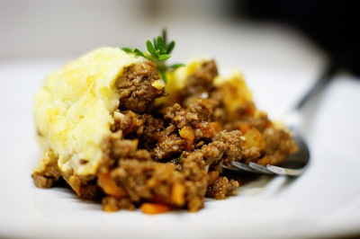

## Shepherd Pie

[Original Recipe from Gordon Ramsays]

** Prep time: 5-15 minutes || Cook time: 20 minutes || Serving: 6-8 || Rating 10/10 **

### Ingredients

** The Filling **

- 2 tablespoons Olive Oil
- about 1.5 lbs ground lamb, chicken legs or beef (see notes below)
- 1 large carrot, grated
- 1 large onion, grated
- bunch frozen peas
- fresh rosemary (dried will work too)
- fresh thyme (dried will work too)
- 4 garlic cloves, minced
- Worcestershire Sauce (several splashes)
- Tomato puree or paste (no more than a small can)
- Red wine (several glugs)
- about 1/4 cup Broth
- Salt and pepper, to taste

** The Mash **
            
- about 1.5 lbs Golden Potatoes
- 2 egg yolks
- 1/4 cup of milk (e.g. cashew, soy etc.)
- 3 Tablespoons of coconut oil 
- 1/4 cup of nutritional yeast
- salt and pepper, to taste
 
### Instructions

** Cooking The Mash **

1. Peel and cubes your potatoes into even pieces. In a pot, add the potatoes and cover them with water. Boil until potatoes are cook (about 10 minutes). 
2. When it is cooked, drain the water off and put the potatoes back in the pot. Mash the potatoes with the following ingredients: egg yolks, milk, coconut oil, nutritional yeast, salt and pepper. 
3. Adjust the taste and put it aside. 

** Cooking the Filling **

1. Pour olive oil into a hot, rather large pan, add the meat to the pan and stir to meat for a few minutes until it is nice and brown. 
2. Add rosemary, thyme, and garlic, then stir some more. Quickly add carrot, onion, and frozen peas, stir a little longer. Get everything to a minced consistency. 
3. Add Worcestershire Sauce, stir, add Tomato Puree, stir, add Red Wine and sweat down for a minute or two. Add chicken stock and cook for 3 more minutes. 
4. Scoop your filling into a deep casserole and then spoon the mash over the top. Spread the mash over the top of the filling. 
5. Poke the top with a fork several times to give it a peaked look and stick it in the oven at 400F for 18-20 minutes to brown the potatoes and set the pie. 

Serve it up and eat it all! 

### Notes

If you are using a whole chicken for ground meat, ground the legs' meat with the skin of the legs and of the breasts. You want a 20% ratio of fat.
If you use beef, take normal ground beef, not the lean nor the extra-lean.
