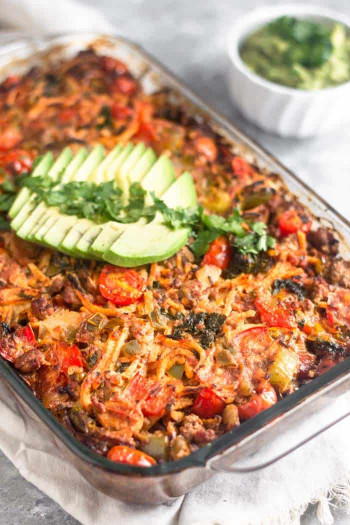

## Taco Casserole

[Original Recipe by Kelly from Eat the Gains](https://eatthegains.com/beef-taco-casserole-paleo-whole30/)

** Prep time: 10 minutes || Cook time: 45 minutes || Serving: 6 || Rating 9.5/10 **

### Ingredients

- 1 pound ground meat (beef, chicken, turkey or sausage)
- 1/2 medium yellow onion, diced (about 1 1/2 cups/175 grams)
- 2 large bell peppers, diced (4 cups/500 grams)
- 1 package of chopped spinach, Drain (300 grams)
- 1 package ramen noodle (227 grams, about 4 cups)
- 2 cups cherry tomatoes, halved (300 grams)
- 1 1/2 tablespoons taco seasoning, divided
- 1 1/4 cup [salsa](../sauces/roasted_salsa.md), divided
- 1/2 cup mayo

** Homemade Taco seasoning mixture **

- 2 tablespoons chili powder
- 2 tablespoons garlic powder
- 2 tablespoons cumin
- 1 tablespoon paprika
- 1 teaspoon cayenne pepper
- 1 teaspoon cinnamon
- 1/2 teaspoon red pepper flakes
- 1/2 teaspoon salt
- 1/2 teaspoon pepper

** Optional Toppings: ** avocado, cilantro, salsa, hot sauce

### Instructions

1. Preheat oven to 375F and grease a large baking casserole.
2. Add the ramen noodles in a large bowl. Pour boiling water over to rehydrate the noodles. 
3. In a large pan, sauté ground meat over medium-high heat until slightly browned (about 3-4 minutes). Set the meat aside with a slotted spoon.
4. In the frying pan with the grease of the meat, add onion and taco seasoning and sauté until translucent (about 2 minutes). Add bell peppers and spinach. Sauté for 2-3 more minutes. Turn off heat. Adjust seasoning to taste. 
5. In a small bowl, mix together salsa and mayo.
	- You don't want to have a runny casserole, if your salsa mixture is too runny, add more mayo for a binder.
6. Mix in the noodles and cherry tomatoes. 
7. Transfer mixture to the baking dish, leaving behind the grease. Pour the salsa mixture. Mix well. 
8. If desired, top with more salsa over the taco casserole, evenly distributing.
9. Bake for 35 minutes until firm and crispy on the top. 
10. Let rest for 5 minutes to firm up some more. 

Top with your favourite toppings and enjoy!

### Notes:

You can freeze the taco casserole after baking it. To defrost, place it in the fridge the night before. To reheat, either put it in the microwave or the oven until warmed through.
