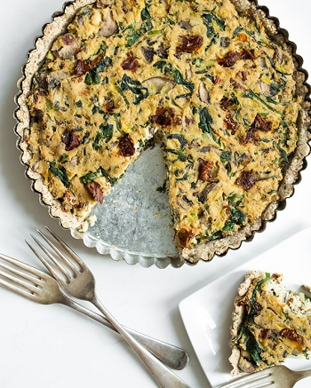

## Sun-Dried Tomato, Mushroom and Spinach Tofu Quiche

[Original Recipe](https://ohsheglows.com/2013/08/27/sun-dried-tomato-mushroom-and-spinach-tofu-quiche/)

** Prep time: 30 minutes || Cook time: 50 minutes || Serving: 8 || Rating 9.5/10 **

### Ingredients

For the crust:

- 1 tablespoon ground flax + 3 tablespoons water, mixed together
- 1 cup almonds flour
- 1 cup oats flour (or buckwheat flour)
- 1 teaspoon dried parsley
- 1 teaspoon dried oregano
- 1/2 tsp kosher salt
- 1 tablespoon coconut oil or olive oil
- 1-2.5 tablespoon water, as needed

For the quiche:

Version #1

- 1 block (14-oz) firm tofu
- 1 tablespoon coconut oil or olive oil
- 1 leek or yellow onion, thinly sliced
- 3 large garlic cloves, minced
- 3 cups (8-oz) sliced cremini mushrooms
- 1/2 cup fresh chives, finely chopped
- 1/2 cup fresh basil leaves, finely chopped
- 1/3 cup oil-packed sun-dried tomatoes, finely chopped
- 1 cup baby spinach
- 2 tablespoon nutritional yeast
- 1 teaspoon dried oregano
- 3/4-1 teaspoon fine grain sea salt
- Black pepper, to taste
- Red pepper flakes, to taste

Version #2

Substitute: sun-dried tomatoes and mushrooms for: 

- 1 cup asparagus, diced
- 1.5 cups broccoli, diced 

### Instructions

1. Preheat oven to 350F. 
2. Lightly grease a round 10 or 9-inch pie dish.
3. Wrap rinsed tofu in a few tea towels. Place a few books on top of it to lightly press out the water. Set it aside.
4. For the crust: 
	1. In a small bowl, whisk together flax and water mixture. Set aside so it can gel up.
	2. In a large bowl, stir together: the almond meal, oat flour (or buckwheat flour), parsley, oregano and salt.
	3. Add in the flax mixture and oil. Stir until mostly combined, adding the remaining water until the dough is sticky (about the consistency of cookie dough). The dough should stick together when you press it between your fingers.
	4. Crumble the dough evenly over the base of the pie dish. Starting from the centre of the pan, press the mixture evenly into the pan, working your way outward and up the sides of the pan. Poke a few fork holes in the dough so air can escape.
	5. Bake the crust at 350F for 13-16 minutes, or until lightly golden and firm to touch. Set aside to cool. 
6. For the filling: 
	1. Break apart the tofu block into 4 pieces and add into food processor. Process the tofu until smooth and creamy. If it doesn't get creamy, add a tiny splash of almond milk.
	2. In a skillet, add oil and saute the leek (or onion) and garlic over medium heat for a few minutes. 
	3. Stir in the mushrooms, season with salt, and cook on medium-high heat until most of the water cooks off the mushrooms, about 10-12 minutes. 
	4. Stir in the herbs, sun-dried tomatoes, spinach, nutritional yeast, oregano, salt, pepper, and red pepper flakes. Cook until the spinach is wilted.
	5. Remove the skillet from heat and stir in the processed tofu until thoroughly combined. 
	6. Adjust seasoning to taste if desired. 
7. Add the filling into baked crust and smooth out until even.
8. Bake quiche, uncovered, at 375F for 33-37 minutes, until the quiche is firm to the touch. 
9. Cool the quiche for 10 minutes on a cooling rack before slicing. The crust may crumble slightly when sliced warm.

Serve it hot or cold. 

### Notes
- You can make it with different vegetables. However don't use a high-water vegetable (e.g. tomatoes) as it might result in a water-logged quiche. 
- You can reheat in the oven for 15-20 minutes at 350F.

