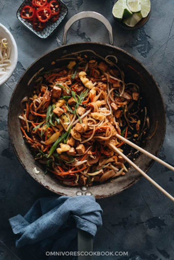

## Vegan Pad Thai

[Original Recipe by Maggie from Omnivore's Cookbook](https://omnivorescookbook.com/vegan-pad-thai/)

** Prep time: 20 minutes || Cook time: 10 minutes || Serving: 4 || Rating 10/10 **

### Ingredients

- 4 oz. (120 g) dried rice noodles
- 1 block (200 g / 7 oz.) extra firm tofu , drained and cut to 1/2” (1 cm) squares
- 3 large eggs
	
** Sauce **

- 1/2 cup soy sauce
- 1/2 cup oyster sauce (vegetarian, *Footnote 1)
- 3 tablespoons palm sugar (or maple syrup)
- 1 tablespoon tamarind paste (if not in available - use Worcester sauce)
- 1/2 tablespoon fish sauce (optional - vegetarian)
- 1/2 tablespoon sriracha sauce (optional - if you want a little spice)

** Stir fry **

- 3 tablespoons peanut oil (or vegetable oil)
- 1 1/2 cup shredded carrots
- 3 shallots (or 1/2 small onion) , sliced
- 5 cloves garlic, minced
- 2 green onions , sliced
- 1 1/2 cup bean sprouts , plus extra for garnish
- 1/4 cup finely chopped peanuts , plus extra for garnish

** Garnish **
- Lime wedges
- Chopped cilantro leaves (Optional)
- Thinly sliced chili peppers (Optional)

### Instructions

1. Combine all the sauce ingredients in a medium-sized bowl and stir to mix well.
2. Transfer the tofu to a medium-sized bowl. Transfer 3 tablespoons of the sauce you just made. Carefully fold together with a spatula, so the tofu is evenly coated with sauce. Marinate for 10 minutes, or until ready to use.
3. Heat a pot of water to bring to a boil. Remove from heat and soak the rice noodles according to the package instructions. It usually takes 5 to 8 minutes, depending on the product. The noodles should become al-dente, soft enough to eat but not too tender.
4. Chop and prep all the veggies and herbs.
5. (Optional) Mix all the ingredients for the vegan egg in a medium-sized bowl. Stir until no lumps remain. To cook the eggs, heat 1/2 tablespoon oil in a small nonstick pan (*Footnote 3) over medium heat until hot. Add the egg mixture. Let cook without touching for 1 to 2 minutes, until the bottom sets completely and the top is still a bit runny. Stir with a spatula to break apart the mixture. Let cook, 3 to 5 minutes, stirring and breaking apart occasionally, until the mixture is cooked through and the surface turns light golden brown. Transfer to a small bowl and set aside.
6. Add 1/2 tablespoon oil to the same nonstick pan. Add the tofu along with the marinade. Cook, stirring occasionally, until the sauce evaporates and the surface of the tofu turns golden brown. Transfer to a plate and set aside.
7. Heat the remaining 2 tablespoons of oil in a wok (or nonstick pan, or carbon steel pan) and heat over medium high heat until hot. Add the carrot, shallots, and garlic. Stir and cook for 1 minute.
8. Add the noodles and pour in the sauce. Toss with a pair of tongs to mix well, 1 minute or so.
9. Add tofu, green onions, and bean sprouts. Toss one more time.
10. Add the peanuts and the cooked chickpea eggs. Give it a final stir and remove the pan from the heat immediately. Transfer everything onto serving plates.

Serve hot as a main dish.

### Notes

- You can also use homemade oyster sauce.
- You can use 2 large eggs to replace this step if you’re cooking a vegetarian (not vegan) dish.
- I used a small nonstick pan and a big carbon steel pan to cook the recipe. If you have a large nonstick pan, you can use this pan for the entire recipe.

