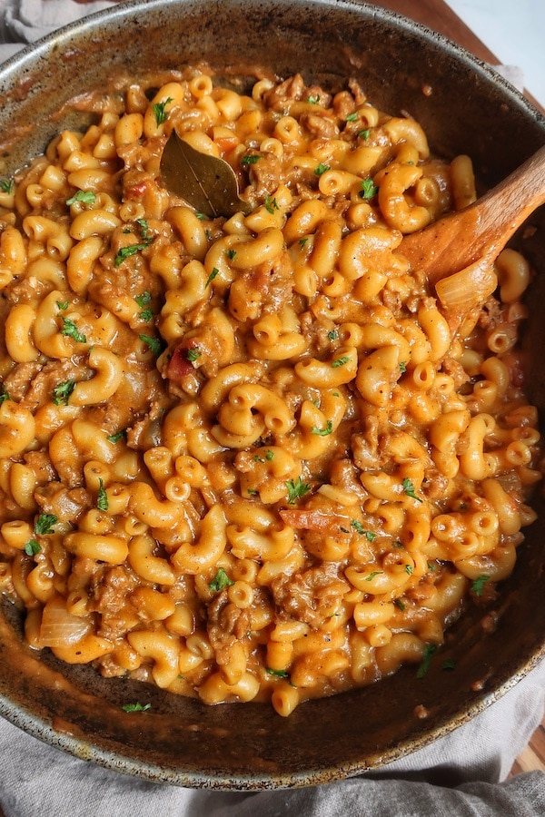

## Cheezy Hamburger Helper

[Original Recipe](https://www.fromthecomfortofmybowl.com/vegan-hamburger-helper/)

** Prep time: 15 minutes || Cook time: 55 minutes || Serving: 4 || Rating 10/10 **

### Ingredients

- 2 tbsp oil
- 1 lb ground meat (sausage, chicken, vegan meat etc.)
- 1 large onion, diced
- 2 cloves garlic, minced
- 1 teaspoon paprika
- 1/2 teaspoon cayenne or chipotle, optional
- 3 tablespoons brandy or white wine, optional
- 1/2 cup [pasta sauce](../sauces/spaghetti_sauce.md) (without adding the meat)
- 3 cups broth
- 1/2 cup soy milk, or cashew or light coconut milk
- 1 bay leaf
- 8 oz elbow macaroni
- salt and pepper, to taste

** Dairy-free Cheeze Sauce **

- 1 medium potato, peeled and chopped
- 1 medium carrot, peeled and chopped
- 1 clove garlic
- 1 small onion or shallot
- 4 tablespoons nutritional yeast
- 1/4 cup olive brine or capers brine,
- 1 teaspoon lactic acid, or 2 teaspoons apple cider vinegar
- 1 teaspoon liquid aminos or tamari
- salt and pepper, to taste
- Put aside 1 cup cooking liquid of the vegetables
     
### Instructions

** Dairy-free Cheeze Sauce **

1. Add the chopped potato, carrots, onion and garlic to a large pot. Add water until it covered and bring to a boil and cook until fork-tender for about 15 minutes.
2. Remove from heat. Put the cooked vegetables into a bowl and put aside 1 cup of the cooking liquid. Allow it to cool before blending. 
3. In a blender, combine cooked vegetables and the remaining ingredients: nutritional yeast, brine, lactic acid, liquid aminos, salt and pepper. Add 1/4 cup of the cooking liquid and blend until smooth and creamy. 
 
** Hamburger Helper **

1. Cook the pasta according to the package direction until al dente.
2. Heat the olive oil over medium-heat. Add the ground meat. Cook until it’s browned for about 5 minutes.
3. Stir in the paprika, cayenne/chipotle, brandy and pasta sauce. Cook for 4 minutes.
4. Pour in broth, soy milk, and bay leaf. Cover and bring to a boil for about 3 minutes at high heat.
5. Stir in the macaroni. Cover and cook for 9 minutes. Stir occasionally.
6. Reduce the heat to low and stir in the vegan cheese sauce. Continue to cook on low until it thickens for about 3 minutes.

Serve warm.

** Note: ** 

- Lactic acid, apple cider vinegar, olive brine and capers brine all help to give the sauce a sharper “cheesier” flavour. Use one or a combination of them all and adjust to your taste.
- If you’re using a large yellow onion, only use a quarter of the amount.
