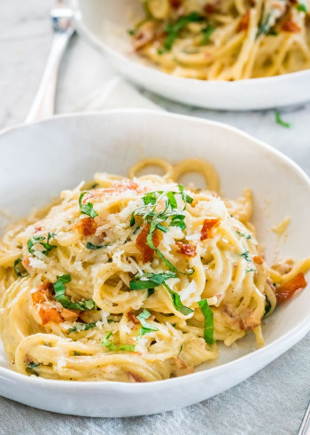

## Creamy Carbonara

[Original Recipe by Joanna Cismaru](https://www.jocooks.com/recipes/creamy-carbonara/)

[Original Recipe by Claire Saffitz](https://www.bonappetit.com/recipe/simple-carbonara)

** Prep time: 5 minutes || Cook time: 40 minutes || Serving: 4 || Rating 10/10 **

### Ingredients

- 8 ounces uncooked (spaghetti, bucatini, rigatoni, fettuccine)
- 6 slices of crips chopped bacon
- 1/2 cup heavy cream
- 2 large eggs
- 4 large egg yolks
- 1 1/2 cups Parmesan cheese freshly grated, plus more for garnish
- Pepper, to taste
- Parsley chopped, a bunch
- 1-2 tablespoons salt

### Instructions

1. Bake the bacon at 350F for 30 minutes or until crisp to your liking. Chopped the bacon.
2. Bring a large pot of salted water to boil over high heat. Add the pasta and cook until al dente. Keep aside 1 cup of pasta water. Drain and set aside.
3. Whisk the heavy cream, egg yolks and eggs until no streaks remain. Mix in grated cheese and pepper. Set aside.
4. In a heavy pot, add the pasta, and the cooking water, cook pasta until water is reduced by half. Stir constantly and vigorously. 
5. Take off the pasta from the heat and ladle the remaining water and put it in the cream mixture very slowly while stiring vigorously.
6. Add the cream mixture to the pot until cheese is melt. 
7. Add the bacon and parsley to the pot and toss well to combine. 
8. Adjust seasoning to taste. 

Garnish with more Parmesan cheese if desired and serve immediately.
