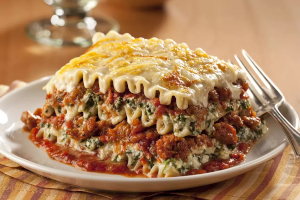

## Vegan Lasagna

[From the Fuss-Free Vegan Cookbook](https://www.amazon.ca/s?k=fuss+free+vegan&crid=2QXY700P3THUW&sprefix=fuss+fr%2Caps%2C-1&ref=nb_sb_ss_i_1_6)

** Prep time: 10 minutes || Cook time: 60 minutes || Serving: 6-8 || Rating X/10 **

### Ingredients

- 1 Tbsp olive oil
- 1 yellow onion, chopped
- 4 cloves garlic, chopped
- 16 oz. mushrooms, chopped
- 7 cups fresh baby spinach, or about 1 1/2 packages frozen spinach, thawed and drained
- 1 bunch fresh basil, roughly chopped
- 1 1/2 cups [ricotta](../sauces/vegan_ricotta.md)
- 1/2 tsp salt
- 1/2 tsp pepper
- 3 cups [pasta sauce](../sauces/italian_tomato_sauce.md)
- 9-12 lasagna noodles, cooked according to package directions (not the oven-ready type)
- 1 1/2 - 2 cups [mozzarella](../sauces/vegan_mozzarella.md)

### Instructions

**Filling**

1. Preheat oven to 375F
1. Heat oil over medium heat in large pan.
1. Add onions, and saute until translucent, about 5 minutes.
1. Stir in mushrooms, and allow to cook for about 3-4 minutes, or until the liquid has evaporated.
1. Mix in garlic, and fry for about 30 seconds, or until fragrant.
1. Add spinach and basil, and cook until wilted, and liquid has evaporated (if using frozen spinach, cook until heated)
1. Add salt and pepper. Remove from heat.

**Assembly**

1. Spread one-quarter of the tomato sauce on the bottom a greased 9- x 13-inch baking dish.
1. Add one layer of noodles.
1. Top with half the filling.
1. Spread one-third of the remaining sauce on the filling, and add another layer of noodles.
1. Add the remaining filling, half the remaining sauce, and a final layer of noodles.
1. Pour in the rest of the sauce, and add the mozzarella.
1. Cover with aluminum foil, and bake for 20 minutes.
1. Remove foil, and bake for another 15-20 minutes, or until the top begins to brown.
1. Remove from the oven, and allow the lasagna to rest for 10-15 minutes. 
