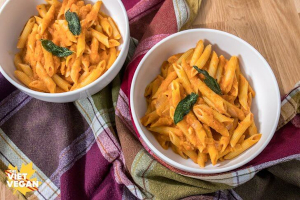

## Pumpkin Penne

[From the Fuss-Free Vegan Cookbook](https://www.amazon.ca/s?k=fuss+free+vegan&crid=2QXY700P3THUW&sprefix=fuss+fr%2Caps%2C-1&ref=nb_sb_ss_i_1_6)

** Prep time: 5 minutes || Cook time: 15 minutes || Serving: 4-6 || Rating X/10 **

### Ingredients

- 450 grams penne, or other short pasta (gluten-free if desired)
- 1 tablespoon butter or olive oil
- 1/2 yellow onion, chopped
- 3 cloves garlic, minced
- 1 can (14 oz) pumpkin puree
- 1 1/2 cups broth
- 1/2 cup [heavy cream](../sauces/vegan_heavy_cream.md)
- 1 teaspoon salt
- 1 teaspoon pepper
- 1/2 teaspoon ground nutmeg
- small handful fresh sage, chopped

### Instructions

1. Cook the pasta according to the directions on the package. Drain, but reserve 1/2 cup of the liquid.
1. Meanwhile, heat the butter/oil in a large pan over medium heat.
1. Add the onion, and fry until softened, and starting to brown, about 7-8 minutes.
1. Add the garlic, and continue to fry for another 30 seconds, or until fragrant.
1. Stir in the remaining ingredients, and bring to a simmer. 
1. Add the cooked pasta to the sauce, and toss well. Add reserved cooking liquid to thin out the sauce to the desired consistency.
