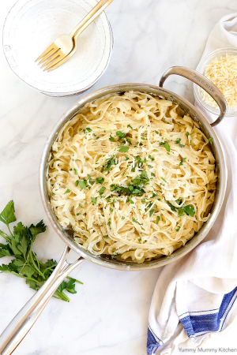

## Vegan Cauliflower Fettuccini Alfredo

[From the Fuss-Free Vegan Cookbook](https://www.amazon.ca/s?k=fuss+free+vegan&crid=2QXY700P3THUW&sprefix=fuss+fr%2Caps%2C-1&ref=nb_sb_ss_i_1_6)

** Prep time: 10 minutes || Cook time: 15 minutes || Serving: 4-6 || Rating X/10 **

### Ingredients

**Sauce**

- 1 cauliflower, roughly chopped
- 4 cloves garlic
- 1 cup broth
- 1 cup [heavy cream](../sauces/vegan_heavy_cream.md)
- 2 tsp white miso paste
- 1 1/2 tsp salt

**Pasta**

- 450 grams fettuccini, or other long pasta (gluten-free if desired)
- [Parmesan](../sauces/vegan_parmesan.md)
- Handful of fresh parsley, chopped
- Black pepper to taste

### Instructions

1. Cook the pasta according to the directions on the package. Drain, but reserve 1/2 cup of the liquid.
1. Meanwhile, place the cauliflower, garlic, broth, cream in a large frying pan, and bring to a simmer over medium heat.
1. Cook for about 10 minutes, or until the cauliflower is very soft.
1. Add the miso paste, and salt.
1. Use an immersion blender to process the mixture until it is very smooth.
1. Add the cooked pasta to the sauce, and toss well. Add reserved cooking liquid to thin out the sauce to the desired consistency.
1. Garnish with parmesan, chopped parsley, and pepper.
