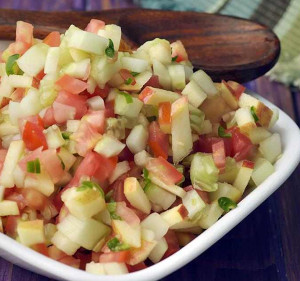

## Cucumber, Apple, and Tomato Salad

[Picture obtained from Trala Dalal](https://www.tarladalal.com/Cucumber-Apple-and-Tomato-Salad-1884r)

** Prep time: 15 minutes || Rating 10/10 **

### Ingredients

- Tomato, chopped
- Cucumber, chopped
- Apples, chopped
- scallions, diced

** Dressing **

- apple cider or balsamic vinegar
- extra-virgin olive oil
- lemon juice
- Salt and pepper 

### Instructions

1. In a large bowl, add and toss desired amounts of all the ingredients. 
2. Mix in the dressing and ajust the seasoning to taste. 

This chilled salad is refreshing.

