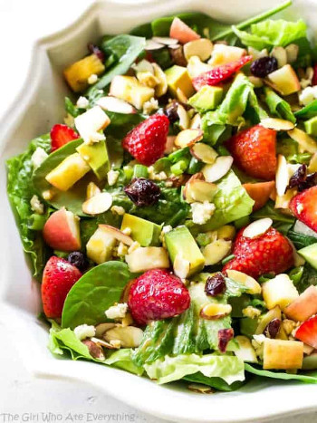

## Apple Green Salad

[Picture obtained from Christy Denney](https://www.the-girl-who-ate-everything.com/fruit-avocado-and-feta-salad/)

** Prep time: 15 minutes || Rating 10/10 **

### Ingredients

- Lettuce, chopped
- Tomato, chopped
- Cucumber, chopped
- Apples, chopped
- Sweet onions, diced
- strawberries, halves (optional)
- Bell pepper, chopped (optional)
- Dry cranberry (optional)
- Pumpkin seeds or slices of nuts (optional)

** Dressing **

- Balsamic vinegar
- Extra-virgin olive oil
- Salt and pepper 

### Instructions

1. In a large bowl, toss all the lettuce, tomatoes, cucumber, apples, bell peppers, onions, dry cranberries and pumpkin seeds to your desired amount. 
2. Mix in the dressing: balsamic vinegar, olive oil, salt and pepper. 
3. Adjust the seasoning. 

This chilled salad goes ludicrously well with any meal you are serving.

