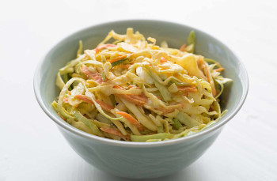

## Classic Coleslaw

** Prep time: 15 minutes || Serving: 8 || Rating 10/10 **

### Ingredients

- 8 cup shredded cabbage
- 3 cups shredded carrots
- 1/2 sweet onion, grated 
- 1/3 cup apple cider vinegar
- 1/2 to 1 cup [homemade mayonnaise](../basics/homemade_mayo.md)
- 1 teaspoon celery seeds
- 1 teaspoon dry mustard
- salt and ground pepper

### Instructions

1. In a large bowl, toss cabbage with 1 teaspoon salt. Put it aside to rest for 1 hour. 
1. In a colander, drain cabbage. By handful, squeeze out excess moisture and return cabbage to the bowl. Add carrots and onions; toss to combine. 
1. Whisk together vinegar mayo, dry mustard, celery seeds, salt and pepper. Toss the slaw well. 
1. Adjust the seasoning and refrigerate for 1 hour. 

Serve cold.
