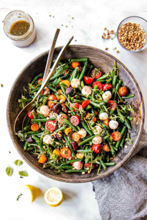

## Green Bean Salad

[Original Recipe](https://carlsbadcravings.com/green-bean-salad/#comments)

** Prep time: 30 minutes || Cook time: 35 minutes || Serving: 10 || Rating 9/10 **

### Ingredients

- 4 medium size beets, (or roasted sweet potatoes or butternut squash)
- 2 pounds fresh green beans trimmed and cut in half
- 2 cups cherry tomatoes, halved
- 1/4 cup minced sweet onions
- 1/2 cup craisins or sweet raisins
- 1 1/2 cups mozeralla, grated
- 1/2 cup toasted pine nuts or crushed walnuts
- cooked chickpeas, optional

** DRESSING **

- 1/4 cup extra virgin olive oil
- 2 tablespoons balsamic vinegar
- 2 tablespoons lemon juice
- 1 teaspoon lemon zest
- 1 teaspoon Dijon mustard
- 1 teaspoon honey
- 2 tablespoons minced fresh basil
- 1/2 teaspoon each for salt, pepper, garlic powder, to taste

### Instructions

1. BEETS: Preheat oven to 400 degrees F. Cut the top and bottom ends off of the beets then peel using a vegetable peeler. Cut the beets into 1- 1 ½ inch chunks. Place beets on a foil lined baking sheet. Toss with 1 tablespoon olive oil and some freshly cracked salt and pepper. Roast for 35-40 minutes or until the beets are fork tender.
DRESSING: While the beets are roasting, prepare the rest of the salad. Add all of the Dressing ingredients to a mason jar and shake vigorously or whisk together in a small bowl. Refrigerate dressing until ready to use. If serving salad within the hour, then place dressing in the freezer to quickly chill.
GREEN BEANS: Bring a large pot of water to a boil and stir in two tablespoon salt. Add the green beans and cook until tender crisp, 1 to 2 minutes. Meanwhile, prepare a large bowl of ice water to transfer the greens to. Using a slotted spoon, transfer beans to ice water to stop cooking. Drain the beans and pat very dry. Transfer to a large salad bowl.
Combine green beans with tomatoes, beets, red onion, and craisins. Drizzle with some of the dressing, cover and chill one hour (time permitting). When ready to serve, toss with arugula, mozzarella, pine nuts and additional dressing if desired. Season with freshly cracked salt and pepper to taste.
RECIPE NOTES
TIPS AND TRICKS 
To save time, you can purchase pre-cut, pre-washed green beans.  They are easy to find in 2-pound bags.  I usually go for the bagged organic green beans because they seem to be thinner.
Take care when working with beets – they can stain everything, including your countertop and hands.  You’ll want to wear gloves or here’s a handy trick:  squeeze some fresh lemon juice directly onto your hands over the sink.  Give them a good rub then wash with soap and water.
The beets will also color the mozzarella cheese, that is why we stir it in at the end.  This discoloration doesn’t bother me, but just a fair warning.
There are a few options when it comes to mozzarella balls.  You can commonly find mozzarella pearls in the specialty cheeses section in a shrink-wrapped package without any water.  These are yummy BUT if you have the option, go with FRESH mozzarella balls, about 1-2 inches, packed in water or brine called Ciliegine. They are fresher, creamier and 10X better. 
I love the Green Bean Salad recipe as written, but feel free to play around with the ingredients per the recipe variations and your own creativity. 
If you skip the craisins, you’ll want to add back something sweet to the salad such as sweet apple, etc. 
Use quality extra virgin olive oil and quality balsamic vinegar because you can TASTE the difference! 
Customize the dressing to your taste.  You can use more or less of any of the ingredients. 
Plan ahead when making the Green Bean Salad so it has time to chill for at least 1 hour, best if 2.  This allows for the beans to marinate in the dressing as the flavors marry and build.
GREEN BEAN SALAD VARIATIONS
This Green Bean Salad recipe is the perfect spring board to get creative!  There are many substitutions and additions you can make depending on your mood or what you have on hand:

Add or swap some of the green beans for kidney beans, garbanzo beans, wax beans, cannellini beans or pinto beans.
Make it ta meal by adding some shredded rotisserie chicken or shrimp.
Add sliced hard-boiled eggs or avocado.
Swap the mozzarella with feta.
Swap the pine nuts with toasted slivered almonds.
Swap the craisins with raisins or a sweet fruit such as apples or peaches.
Add quinoa, brown rice, farro or couscous.
Add roasted butternut squash, corn, potatoes or sweet potatoes.
MAKE AHEAD
You can prepare the salad but hold the arugula, mozzarella, pine nuts and additional dressing.  Cover and refrigerate for up to 2
