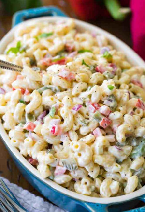

## Macaroni Salad

** Prep time: 10 minutes || Cook time: 20 minutes || Serving: X || Rating 9.5/10 **

### Ingredients

- Macaroni pasta
- 3 bell peppers (red, yellow, orange), diced
- carrot, diced
- 2 stalk celery, diced
- shallot, diced
- [homemade mayonnaise](../basics/homemade_mayo.md)
- salt and pepper

### Instructions

1. In a big pot over medium-high heat, boil the macaroni pasta until it al dente. Remove from the stove and drain immediately. Pour and drain cold water over the pasta.
	- Cook it just before it ready to eat regular pasta.
2. Add all your diced vegetables, mayonnaise, salt and pepper. Mix well. 
3. Adjust to taste. 

Rejoiced in one of childhood staples!
