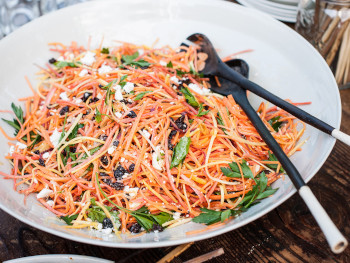

## Spicy Moroccan Carrot Slaw

[Picture obtained from food and wine](https://www.foodandwine.com/recipes/moroccan-carrot-salad-with-spicy-lemon-dressing)

** Prep time: 15 minutes || Serving: 20 || Rating 9.5/10 **

### Ingredients

- 4 pounds carrots, julienned on a mandoline or coarsely shredded in a food processor (about 12 cups) 
- 2 cups raisins 
- Fresh lemon juice, to taste (about 2/3 cup) 
- 1/2 cup extra-virgin olive oil 
- cumin, to taste (for the spiciness)
- Salt and Ground pepper, to taste 

### Instructions

1. In a large bowl, whisk the lemon juice, olive oil, salt and pepper.
2. Add the carrots, and raisins to the dressing. Toss well. 

Serve lightly chilled or at room temperature.

