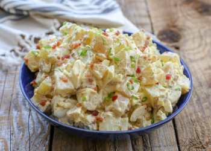

## Potato Salad

** Prep time: 15 minutes || Cook time: 30 minutes || Serving: 8 || Rating 10/10 **

### Ingredients

- 6 yukon Gold Potatoes (or white or yellow), chopped
- 1/2 pounds of bacon (optional)
- 8 green onions, diced
- 2 stalk of celery, diced
- 4-5 hard boiled eggs, chopped
- 2 apples, chopped (optional)
- Salt and pepper

** For the dressing **

- 1/2 cup of mayonnaise
- 1/4 cup Dijon mustard
- 3 tablespoons apple cider vinegar
- 2 tablespoons reserved bacon fat (optional)
- 4 dill pickles, chopped (or 2 tablespoons relish)
- bunch of fresh dill, diced

### Instructions

1. At the same time, cook the following ingredients until they are ready.
	1. Put potatoes in a large pot and cover with cold water. Add salt and bring to a simmer. Cook until the potatoes are tender. Drain the water and put aside. 
	2. Cook the bacon at 400F until it is golden and crispy. Drain the bacon fat reserving a few tablespoons for the dressing. Chopped the bacon into pieces. 
	3. Put the eggs in a pot and cover them with cool water by 1 inch. Cover the pot with a lid and bring water to a rolling boil over high heat; when the water has reached a boil, set the timer for 6 – 7 minutes over medium-high heat. Peel the eggshells off and chopped the eggs.
2. In a bowl, Whisk all the ingredients for the dressing together.
2. Mix in the potatoes, bacon, eggs, celery, apples, and green onions in a large salad bowl. Add the dressing and season with salt and pepper. Toss well.
3. Adjust seasoning to taste. 

Refrigerate for at least 1-2 hours. 

Serve cold.

