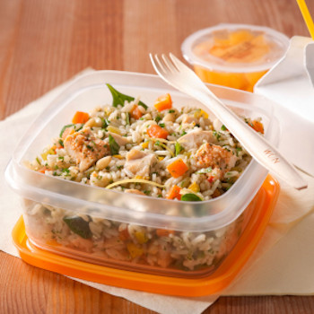

## Chicken and Rice Salad
 

** Serving: 4 || Rating 10/10 **

### Ingredients

- 1 cup cooked chicken, cubed
- 2 cups cooked rice
- 1/4 cup green peppers, diced
- 1 cup celery, diced
- 1/4 cup of mayonnaise (or [homemade mayo](../basics/homemade_mayo.md))
- 1/4 teaspoon thyme
- salt and pepper 

### Instructions

1. In a medium size bowl, combine all the ingredients and mix well.
2. Cover and chill.

Serve cold.
