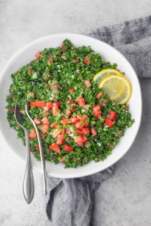

## Tabbouleh

[Original Recipe by Yumma Jawad](https://feelgoodfoodie.net/recipe/traditional-lebanese-tabbouleh-salad/)

** Prep time: 40 minutes || Serving: 6 || Rating X/10 **

### Ingredients

- 1/3 cup extra virgin olive oil
- 3 tablespoons lemon juice
- 1/4 cup extra fine bulgur wheat
- 2 bunches parsley about 2 cups, finely chopped
- 1-2 ripe firm tomatoes, finely chopped
	- When preparing the tomatoes, it helps to use a colander to drain the excess juice
- 2 green onions both green and white part, finely chopped
- 1/4 cup fresh mint leaves (optional)
- Salt and pepper to taste

### Instructions

1. In a small bowl, whisk together olive oil and lemon juice until well combined. Then add the bulgur to the dressing and let it soak until it is soft and plumped, about 15 minutes.
2. Place the chopped vegetables in a large bowl. Add the optional mint. Season with salt and pepper. Then pour the bulgur and dressing mixture over. Gently toss to combine.

Serve at room temperature or cold, with lettuce if desired.
