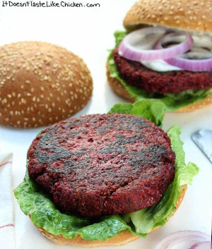

## Beet Burger

[Original Recipe](https://itdoesnttastelikechicken.com/vegan-beet-burgers/)

** Prep time: 100 minutes || Cook time: 10 minutes || Serving: 6 || Rating 10/10 **

### Ingredients

- 4 cups grated raw peeled beets (about 4 medium beets)
- 3/4 cup large flake rolled oats
- 1 can (14 oz) cooked lentils
- 3/4 cup all-purpose flour
- 1/2 yellow onion, chopped
- 2 cloves garlic, chopped
- 2 tablespoon natural peanut butter
- 2 teaspoons dried thyme leaves
- 2 teaspoons of cumin
- 1/2 teaspoon salt
- 1/4 teaspoon black pepper

Burger toppings: 

- Buns 
- Onions
- Pickles
- Tomatoes
- Pickles beets
- lettuces
- Mayonaisse
- Hot sauce

### Instructions

1. Grate beets with the grater. Then add the beets, along with all of the remaining ingredients to the food processor. Mix until the mixture comes together. 
	- The consistency should be like egg whites beaten to stiff peaks. Add more oats or flour to obtain the right consistency.
2. Heat enough oil to cover the bottom of a large skillet over medium heat. When hot, add the the mixture and form the patties about the size of your buns in the frying pan. 
	- Cooking them low and slow is the key for good texture. 
3. Cook about 3 to 5 minutes per side, until they are nicely browned on both sides and hold together well. 

Serve hot on a bun with your favourite burger toppings.

