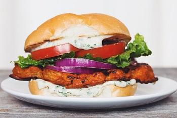

## Buffalo Cauliflower Burger

[Original Recipe by Lauren Toyota](https://www.hotforfoodblog.com/recipes/2014/11/01/vegan-buffalo-cauliflower-sandwich/)

** Prep time: 25 minutes || Cook time: 50 minutes || Serving: 6 || Rating 10/10 **

### Ingredients

Cauliflower Burgers: 

- 1 head of cauliflower (3 thick slices, 6 halves)
- 1/2 cup nondairy milk
- 1/2 cup water
- 3/4 cup all-purpose flour (or rice flour if gluten free)
- 2 teaspoons garlic powder
- 2 teaspoons onion powder
- 1 teaspoon ground cumin
- 1 teaspoon ground paprika
- 1/4 teaspoon sea salt
- 1/4 teaspoon ground black pepper
- 1 tablespoon vegan butter
- 1/2 cup Frank's RedHot sauce (very spicy)
	- Less spicy: 1/4 cup Frank's RedHot sauce
	- Mild: 

Ranch sauce:

- 1 cup vegan mayonnaise
- 2 teaspoon apple cider vinegar
- 2 tablespoon finely chopped fresh dill
- 2 tablespoon finely chopped fresh parsley
- 2 tablespoon finely chopped chives
- 1 teaspoon onion powder
- 1 teaspoon garlic powder
- salt and black pepper, to taste

Topping for your burgers: 

- burger buns (can be slightly toasted)
- onions, slices
- lettuce
- tomatoes, slices
- Ranch sauce, to spread on each side of the bun
- Cauliflower burger

### Instructions

1. Line a baking sheet with parchment paper and preheat oven to 450°F.
2. Trim off any green leaves at the base of the cauliflower, but leave most of the stem in tact. Cut the head of cauliflower in half and then cut 2-inch x 1/2-inch steaks from each of the inside sides. You can use the remaining cauliflower to make buffalo wings or just use it in another recipe like my mushroom sage cauliflower risotto. Roasting it in the oven with sea salt, ground black pepper, and olive oil is delicious, too!
3. Mix the flour, nondairy milk, water, spices, sea salt, and ground black pepper in a mixing bowl with a whisk until well combined. Transfer this mixture to a wide shallow baking dish that will fit your cauliflower steaks. Dredge the steaks through the batter and use your hands to coat them quite well, getting in all the crevices. Place the battered cauliflower steaks onto the parchment lined baking sheet and bake for 25 minutes. Meanwhile, prepare the ranch sauce and buffalo sauce.
4. In a bowl, whisk all the ingredients together for the ranch. Refrigerate until you're ready to assemble the sandwiches.
5. Just before the cauliflower is finished baking, melt the vegan butter and whisk it into the hot sauce in a shallow dish you can dredge the cauliflower steaks in once again.
6. Remove the cauliflower from the oven. You may want to let them cool so you can handle them. You might need to replace your parchment paper if it's really soaked through or burned quite a bit.
7. Dredge the cauliflower steaks through the buffalo sauce, making sure to coat them evenly. Bake again on a parchment lined baking sheet for 25 minutes.
8. Assemble the burger and serve.
