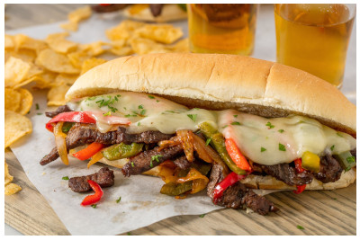

## Fijiji Cheesesteak Sandwiches

** Prep time: 15 minutes || Cook time: 20 minutes || Serving: 4-6 || Rating 9/10 **

### Ingredients

- 4-6 hoagie rolls
- 1 1/2 pounds top round steak, thin slices
- 1 sweet onion, slices (optional)
- 4-6 bell peppers, slices (optional)
- mushroom, slices (optional)
- 1/4 lbs Cheeze (Gusta artisanal vegan Italian) or Cheese (provolone/mozerrella/swiss cheese/parmesan), slices or grates
- Olive oil
- Salt and pepper

*- Pesto*

- basil
- walnuts
- parmesan cheese
- olive oil

*- Tomato sauce*

- tomato crushed can
- oregano
- salt and pepper
- parsley
- thyme
- paprika

### Instructions

1. With a food processor, blend in the parmesan cheese. Add walnuts and blended. Add basil and blend well. Then add olive oil and blend until it is a spread.
1. Over medium high heat, make the tomato sauce by adding all its ingredients: tomato crushed, oregano, parsley, salt and pepper. Adjusted to taste. 
1. Heat the frying pan with olive oil and saute steak over medium-high heat until desired doneness and remove from the pan. 
1. Warm the oil in a large skillet over low heat. Add onions and cook 8 to 10 minutes, until caramelized and softened, stirring frequently. Do not allow them to brown. Transfer onions to bowl. 
1. Add bell pepper to same skillet, still over low heat. Cook peppers 10 to 15 minutes, until soft and tender, flipping often. Transfer to a bowl. 
1. Cook mushroom 10-15 minutes, until soft and tender. Transfer to a bowl. 
1. Season the onion, the bell pepper and the mushroom with salt and peppercorn to taste. 
1. Slice a hoagie roll open. Fill it with tomato sauce, pesto, steak, bell peppers, onions and top it with cheese. 
1. Bake the open subs on broil for about 10 minutes or until the cheese is melt. 

Serve warm.

