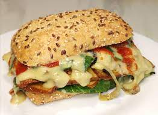

## Smoked Tofu Sandwich

[Original Recipe](https://www.LINK_TO_RECIPE)

** Prep time: 15 minutes || Cook time: 20 minutes || Serving: 4-6 || Rating X/10 **

### Ingredients

- 90g smoked [marinated tofu](../../basics/marinating_tofu/), cut into thin slices
- 1 small sweet onion, slices (optional)
- 1 bell peppers, slices (optional)
- mushroom, slices (optional)
- 1 garlic cloves, minced
- dried hot chillies (optional)
- Salt or pepper
- 4-6 Buns

** Toppings **

- [Roasted salsa sauce](../../sauces/roasted_salsa.md/)
- [Mayonaise](../../basics/homemade_mayo.md/)
- Cheeze (Gusta artisanal vegan Italian) or Cheese (provolone/mozerrella/swiss cheese/parmesan), slice or grated (optional)
- Pickles, slices
- Pickles beets, slices
- Lettuce, shredded
- Tomato, slices

### Instructions

1. Heat olive oil in a pan on medium high heat. Optional, add a few dried hot chillies and remove them later, after cooking. 
2. Warm the oil in a large skillet over low heat. Add onions and cook 8 to 10 minutes, until caramelized and softened, stirring frequently. Do not allow them to brown. Add garlic and fry for 30 seconds. Transfer onions and garlic to bowl. 
3. Add bell pepper to same skillet, still over low heat. Cook peppers 10 to 15 minutes, until soft and tender, flipping often. Transfer to a bowl. 
4. Cook mushroom 10-15 minutes, until soft and tender. Transfer to a bowl. 
5. Season the onion, the bell pepper and the mushroom with salt and peppercorn to taste. 
6. Fry the tofu for 4 minutes until golden. 
7. Arrange the prepared ingredients on the bun.
8. Bake the open subs on broil for about 10 minutes or until the cheese is melt. 

Serve warm.

