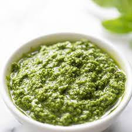
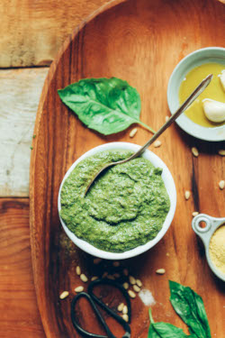

## Basil Pesto

### Classic Basil Pesto 

** Prep time: 15 minutes || Yield: 1 cup || Rating 10/10 **

** Ingredients **

- 2 cups fresh basil leaves, tightly packed (no stems)
- 1/2 cup freshly grated Romano or Parmesan cheese
- 1/2 cup extra virgin olive oil
- 1/3 cup pine nuts or walnuts
- 3 garlic cloves, minced (about 3 teaspoons)
- salt and pepper, to taste

** Instructions **

1. Place the basil leaves and nuts into a food processor and pulse a several times. 
2. Add the garlic and cheese and pulse several times more. Scrape down the sides of the food processor. 
3. While the food processor is running, slowly add the olive oil in a steady small stream. Scrape down the sides of the food processor. 
	- Adding the olive oil slowly, while the processor is running, will help it emulsify and help keep the olive oil from separating.
4. Stir in salt and freshly ground black pepper to taste.
5. Adjust the ingredients to taste if necessary.

Serve by tossing with pasta for a quick sauce, dollop over baked potatoes, as a sauce or spread onto crackers or toasted slices of bread. 

Notes: For a basic basil pesto, remove garlic, salt and pepper from the ingredients.

### Vegan (dairy-free) Basil Pesto 

[Original Recipe](https://minimalistbaker.com/easy-vegan-pesto-5-minutes/)

** Prep time: 15 minutes || Yield: 1 cup || Rating X/10 **

** Ingredients **

- 2 cups tightly packed fresh basil (large stems removed)
- 3 tablespoons pine nuts or walnuts (if nut-free: sunflower seeds)
- 3 large cloves garlic, minced
- 2 tablespoons lemon juice
- 3-4 tablespoons nutritional yeast
- 2-3 tablespoons extra virgin olive oil
- 3-6 tablespoons water (as needed)
- salt and pepper, to taste

** Instructions **

1. To a food processor, add the basil, nuts, garlic, lemon juice, nutritional yeast, and sea salt and blend/mix on high until a loose paste forms.
2. While the food processor is running, slowly add the olive oil in a steady small stream. Scrape down the sides of the food processor. 
	- Adding the olive oil slowly, while the processor is running, will help it emulsify and help keep the olive oil from separating.
3. Add 1 tablespoon water at a time until the desired consistency is reached – a thick but pourable sauce.
4. Stir in salt and freshly ground black pepper to taste.
5. Taste and adjust flavor as needed, adding more nutritional yeast for cheesy flavor, salt for overall flavor, nuts for nuttiness, garlic for bite / zing, or lemon juice for acidity.

Serve by tossing with pasta for a quick sauce, dollop over baked potatoes, as a sauce or spread onto crackers or toasted slices of bread. 
