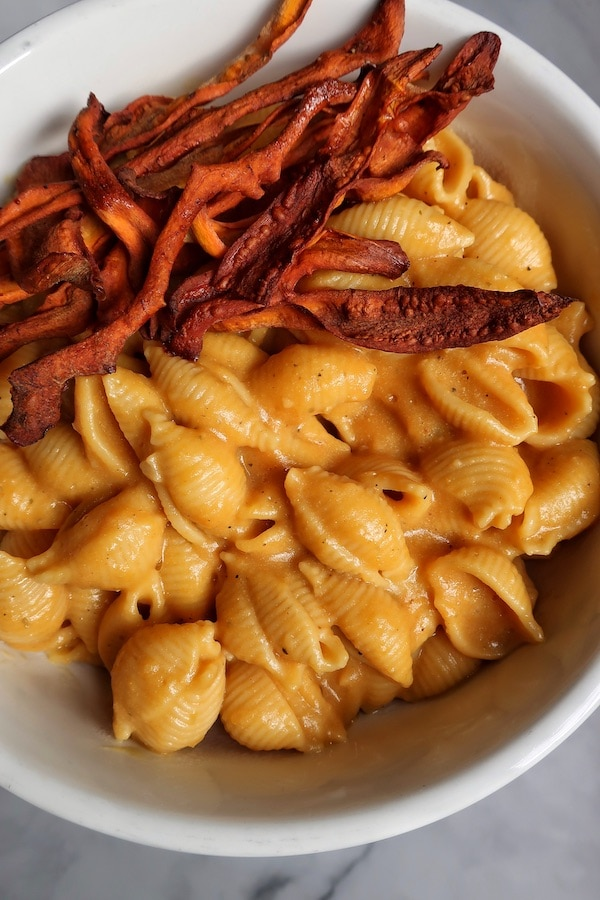

## Cheeze Sauce (Carrots & Potato)

This is a very versatile sauce that can be used in mac and cheese, nachos, poutine, jalapeno poppers etc. 

[Original Recipe](https://www.fromthecomfortofmybowl.com/vegan-mac-and-cheese/)

** Prep time: 10 minutes || Cook time: 15 minutes || Serving: 4 || Rating 9.5/10 **

### Ingredients

- 1 medium potato, peeled and chopped
- 1 medium carrot, peeled and chopped
- 1 clove garlic
- 1 small onion or shallot
- 4 tablespoons nutritional yeast
- 1/4 cup olive brine or capers brine,
- 1 teaspoon lactic acid, or 2 teaspoons apple cider vinegar
- 1 teaspoon liquid aminos or tamari
- salt and pepper, to taste
- Put aside 1 cup cooking liquid of the vegetables

### Instructions

1. Add the chopped potato, carrots, onion and garlic to a large pot. Add water until it covered and bring to a boil and cook until fork-tender for about 15 minutes.
2. Remove from heat. Put the cooked vegetables into a bowl and put aside 1 cup of the cooking liquid. Allow it to cool before blending. 
3. In a blender, combine cooked vegetables and the remaining ingredients: nutritional yeast, brine, lactic acid, liquid aminos, salt and pepper. Add 1/4 cup of the cooking liquid and blend until smooth and creamy. 

** Note: ** 

- Lactic acid, apple cider vinegar, olive brine and capers brine all help to give the sauce a sharper “cheesier” flavour. Use one or a combination of them all and adjust to your taste.
- If you’re using a large yellow onion, only use a quarter of the amount.

### Turn Cheeze Sauce into Queso Dip

1. Thin the sauce out with an additional 1/4 cup (60 mL) reserved liquid or unsweetened milk. 
2. Mix in with roasted salsa sauce (or diced small tomato, and finely chopped jalapeno or green chilies).

Serve it your choice of meal. For example mix the sauce in mac and cheese or use it as a dip with tortilla chips. 
