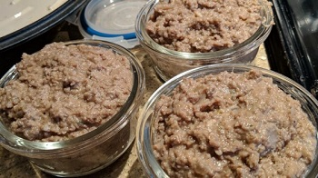

## Cretons

[Original Recipe by Nans](https://www.allrecipes.com/recipe/33629/cretons/)

** Prep time: 10 minutes || Cook time: 1h10 minutes || Serving: 12 || Rating 10/10 **

### Ingredients

- 1 pound ground pork or chicken* See notes
- 1 cup milk
- 1 onion, chopped
- 1-2 cloves of garlic, minced
- ground cloves, to taste
- ground allspice, to taste
- 1/4 cup dry bread crumbs (if using fresh bread crumbs: 1/2 cup) (optional)
- salt and pepper, to taste
- parsley and dry minced green onion (optional)

### Instructions

1. Place the ground pork, milk, onion and garlic into a large saucepan. 
2. Season with salt, pepper, cloves and allspice. 
3. Cook over LOW heat for about 2 hour or until most of the liquid has been reduced.
	- To increase creaminess: use an immersion blender after 20 min. of cooking. It improves the texture. 
	- It take a while to cook, even if the liquid looks all gone. 
	- Do not constantly stir; you only need to stir a few times during cooking.
4. Stir in the bread crumbs. 
5. Cook for 10 more minutes. Adjust seasonings to taste. 
6. While it still hot transfer it in a food processor and turn it in a perfect puree.
	- If using parsley and dry green onion, add it in the food processor as well.
7. Transfer to a small tight container and keep refrigerated or freeze it for long term storage.

### Notes
- It is imperatif that you use non lean meat. You need fat if you want the cretons to taste and have the right consistancy. 
- If you dont have the full fat ground pork meat, add 1/2 cup of lard to the ingredients. It should add the right amount of fat. 
- If you are using chicken, make sure you are using chicken tigh and legs as well as their skins and extra skin from the breast of the chicken as they contain the most amount of fat. 
- If you are using bread crumbs, fresh ones taste better.
