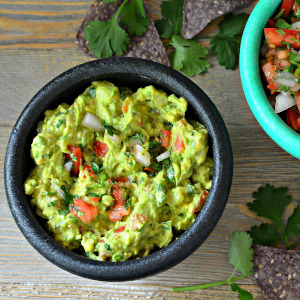

## Guacamole

[Original Recipe by Bob Cody](https://www.allrecipes.com/recipe/14231/guacamole/)

** Prep time: 10 minutes || Serving: 4 || Rating 9/10 **

### Ingredients

- 3 avocados, pitted and mashed
- 1 lime juiced
- 1 teaspoon salt
- 1/2 cup diced onion
- 2 roma (plum) tomatoes, diced
- 1 teaspoon minced garlic
- 3 tablespoons chopped fresh cilantro (Optional)
- 1 pinch ground cayenne pepper (Optional) 

### Instructions

1. In a medium bowl, mash together the avocados, lime juice, and salt. 
2. Mix in onion, cilantro, tomatoes, and garlic. 
3. Stir in cayenne pepper. 

Serve immediately or refrigerate 1 hour for best flavor. 
