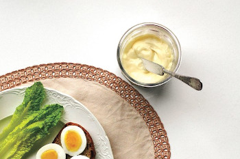

## Classic Homemade Mayonnaise

[Original Picture from Molly Wizenberg](https://www.epicurious.com/recipes/food/views/homemade-mayonnaise-241868)

** Prep time: 5 minutes || Serving: 1 cup || Rating 10/10 **

### Ingredients

- 1 egg yolk
- 1 cup of olive oil
- 1/2 tablespoon of Dijon mustard
- dash of white wine vinegar (optional)
- Dash of lemon juice
- Pinch of salt

### Instructions

1. Combine egg yolk, lemon juice, vinegar, mustard, and salt in medium bowl. Whisk until blended
2. While whisking constantly, gradually add olive oil in very slow thin stream, until mayonnaise is thick. 

Refrigerate until use. 
