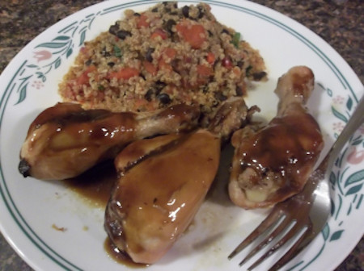

## Honey Garlic Sauce

[Original Recipe by Sandi's allergy free recipes](https://www.sandisallergyfreerecipes.net/honey-garlic-sauce-gluten-free-refined-sugar-free/)

** Prep time: 5 minutes || Cook time: 10 minutes || Serving: 1/2 to 1 cup || Rating 10/10 **

### Ingredients

- 1/2 cup honey
- 1/2 cup water
- 1 teaspoon tapioca or arrowroot starch
- 3 tablespoon of coconut aminos or tamari soy sauce
- 2 cloves garlic, minced 

### Instructions

1. Whisk together all the ingredients in a small pot.
2. Then put the pot on medium low heat and bring to boil. Continue whisking until it thicken (for about 5 minutes). 
	- it is important to keep an eye on it since it will suddenly become thick.
	- If it has not thicken after 6-7 minutes, add more flour/starch a little at a time and continue whisking until it 		  thicken.
3. When the consensity is right, take off the heat and serve warm 

Note: It can be store in the fridge for up to two weeks. 

