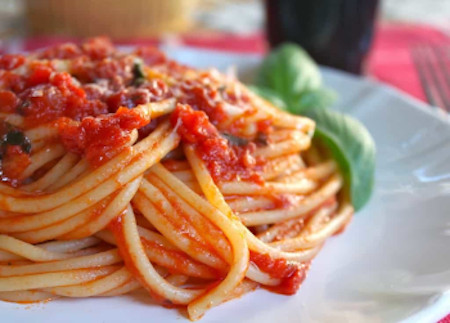

## Authentic (Quick) Italian Tomato Sauce for Pasta

[Original Recipe by Christianne Cote](https://www.christinascucina.com/authentic-quick-italian-tomato-sauce/)

** Prep time: XX minutes || Cook time: XX minutes || Serving: 6 || Rating X/10 **

### Ingredients

- 4 tbsp extra virgin olive oil (like Lucini)
- 4 or 5 cloves fresh garlic (not in a jar, dried, powdered, or frozen) preferably grown in USA
- small bunch of fresh Italian parsley, finely chopped (my family likes to use parsley in sugo)
- 1 (28-32 oz) carton/jar of chopped tomatoes or puree (like Mutti, or Bionaturae– I no longer like POMI since their tomatoes are no longer good quality) ultimately, chopped fresh Roma tomatoes are best if you have them
- about 1 1/2 level tsp Diamond Crystal Kosher or sea salt
- 3 or 4 large leaves of fresh basil
- Parmigiano Reggiano to grate

Note: To obtain a delicious sauce, you need quality ingredients. If you use inferior quality, you will not have the same outcome, or the same flavor as the authentic italian sauce.

### Instructions

1. Pour the oil into a large saute pan (not a deep pot) over medium high heat. Crush the garlic and add it to the oil (if you want a spicy sauce, you can add some hot pepper, fresh or flakes, at this point). Saute the garlic until it just starts to brown, then add the parsley.
2. Turn the heat up to high. Now add the tomatoes, and quickly cover with the lid for about 30 seconds, until the squirting subsides. Stir with a wooden spoon and lower the heat a little. It is important that this sauce is cooked at a fast simmer, as it is cooked briefly.
3. Add the salt and continue to simmer at a fast pace, and stir often.
4. The sauce will thicken quickly, so do not overcook it, and have it become too thick; about 5 to 7 minutes should be sufficient.
5. Taste the sauce, if it doesn't taste delicious, it probably just needs a little more salt. Turn off the heat and add the fresh basil (I tear mine into pieces). Also, unless absolutely necessary, do not wash your basil. Wipe it with a damp paper towel instead, so the water doesn't ruin the flavor and aroma.
6. Add sauce to the drained pasta (save some pasta water to add back into the pasta in case it's too dry), and enjoy immediately with some freshly grated authentic Parmigiano Reggiano cheese and/or pepper.
7. Also, if you've been plating pasta in a bowl, then topping it with sauce, this is American-style. If you want to serve it the way they do in Italy, mix the sauce in and then plate it.
