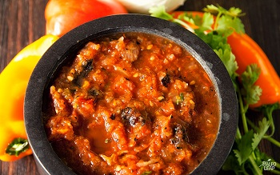

## Roasted Salsa

[Original Recipe by Sébastien Noël from Paleo Leap](https://paleoleap.com/fire-roasted-salsa/)

** Prep time: 15 minutes || Cook time: 30 minutes || Serving: 4 || Rating 10/10 **

### Ingredients

- 2 pounds Roma tomatoes, halves
- 1 jalapeño pepper, halves
- 1 large white onion, cut in quarted or halves (depend on the side of the onion)
- 3 garlic cloves
- 1/2 bunch cilantro
- 1 tablespoon lime/lemon juice
- 1/4 teaspoon cumin
- 1/2 teaspoon oregano
- salt and black pepper, to taste

### Instructions

1. Preheat the oven at 400F 
	- Or the grill to a medium-high heat
2. Place the tomatoes, onion, jalapeño, and garlic in a single layer on a baking sheet.
3. Cook the vegetables until blackened on all sides, 10 to 15 minutes per side.
4. Transfer the cooked vegetables to a food processor 
5. Add the cumin, the lime juice, the oregano, the cilantro, and pulse until coarsely pureed.
6. Season with salt and pepper to taste. 

Refrigerate or serve warm right away.

Note: If you dont have 20-30 minutes cooking time, just put all the vegetables and spices in the food processor. It will be fine.