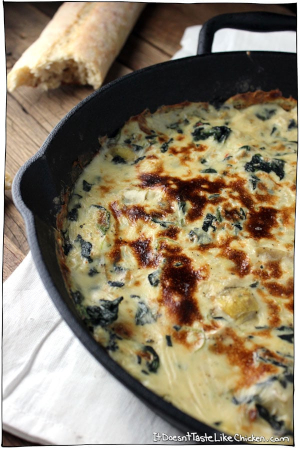

## Spinach Artichoke Dip

[From the Fuss-Free Vegan Cookbook](https://www.amazon.ca/s?k=fuss+free+vegan&crid=2QXY700P3THUW&sprefix=fuss+fr%2Caps%2C-1&ref=nb_sb_ss_i_1_6)

** Prep time: 5 minutes || Cook time: 25 minutes || Serving: 6 || Rating X/10 **

### Ingredients

- 1 Tbsp olive oil
- 1/4 yellow onion
- 2 cloves garlic, minced
- 4 cups fresh baby spinach, or one package frozen, chopped spinach thawed and drained
- 1 1/2 - 2 cups shredded [mozzarella](vegan_mozarella.md)
- 1 jar (6 oz) marinated artichoke hearts, drained and roughly chopped
- 1/2 cup non-dairy milk, plus up to an additional 1/2 cup as required
- 1/2 tsp salt
- 1/2 tsp pepper

### Instructions

1. Preheat oven to 400F.
1. In an oven-safe frying pan, heat the olive oil over medium heat.
1. Fry the onion until softened (about 3-4 minutes).
1. Add the garlic, and fry until fragrant (about 30 seconds).
1. Add the spinach, and cooking until the spinach is fully wilted, and all liquid has evaporated (3-5 minutes with fresh, fewer with frozen).
1. Remove from heat, and stir in the mozzarella, artichoke hearts, milk, salt, and pepper.
1. Bake for 20 minutes, stirring after 10 minutes. Add additional milk 1 Tbsp at a time if the mixture is too thick.
1. Optionally broil for 1-3 minutes, or until the top is golden and bubbling.
1. Serve with dippable foods.

