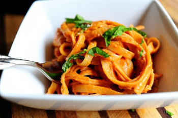

## Basic Tomato Cream Sauce

[Original Recipe by The Pioneer Woman](https://www.thepioneerwoman.com/food-cooking/recipes/a9451/pasta-with-tomato-cream-sauce/)

** Prep time: 10 minutes || Cook time: 15 minutes || Serving:  || Rating 10/10 **

** Still taste good without onions and garlic for meal like pasta, sloppy joe, pizza, subs **

### Ingredients

- 2 (15-ounce) cans tomato sauce or 1 (5-ounce) can tomato paste plus 2 cups of water
- 1 cup of heavy cream 
- 2 tablespoons olive oil
- 2 tablespoons butter
- Grated parmesan or Romano cheese, to taste
- Salt and pepper, to taste
- Dash of sugar, to taste
- Basil, to taste
- Parsley, to taste
- Oregano, to taste
- Thyme, to taste
- 1 medium onion, finely diced (optional)
- 4 cloves garlic, minced (optional)

### Instructions

1. Heat butter and oil over medium heat. 
2. If using add onions and saute until translucent (about 5 minutes). Add Garlic and saute for 30 seconds. 
3. Pour in tomato sauce and add salt, pepper, and sugar to taste. Stir and cook over low heat for 10 minutes, stirring occasionally.
4. Remove from heat and stir in cream. Add cheese, herbs to taste, then check seasonings.

Can add meat and vegetables after step 3 depending on what you are using the sauce for.
