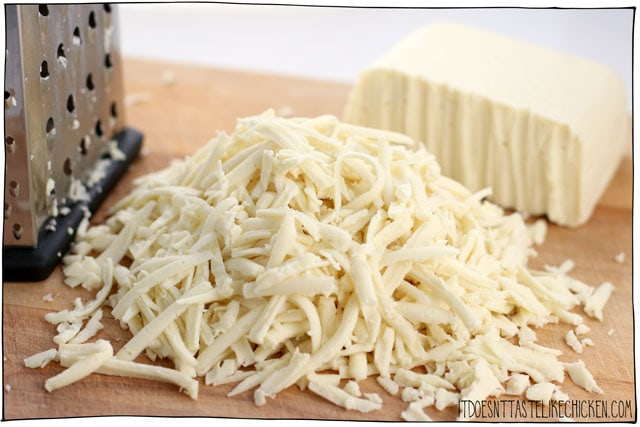

## Cashew-based Vegan Mozarella

[From the Fuss-Free Vegan Cookbook](https://www.amazon.ca/s?k=fuss+free+vegan&crid=2QXY700P3THUW&sprefix=fuss+fr%2Caps%2C-1&ref=nb_sb_ss_i_1_6)

** Prep time: 5 minutes || Cook time: 7 minutes || Yield: 1 1/2 cups || Rating X/10 **

### Ingredients

- 1 cup water
- 1/2 cup soaked, raw cashews (can be substituted with almonds or macadamia nuts)
- 3 Tbsp, plus 1 tsp tapioca starch
- 2 Tbsp nutritional yeast
- 2 Tbsp green olive brine, or 1 Tbsp sauerkraut
- 1/2 tsp garlic powder
- 1/2 tsp salt

NOTE: If using this cheese on pizza, or in a lasagna, etc. add an extra 1/3 cup water

### Instructions

1. Place all ingredients in a high-speed blender, and blend until completely smooth. The mixture will have a watery texture.
1. Pour the mixture in a small saucepan, and heat over medium-high heat, stirring constantly. 
1. After about 5 minutes, the mixture will form a cheesy goo. Cook while stirring for an additional minute.
1. Store in an air-tight container in the fridge for up to one week, or freeze.

Notes:

- if the cheese is too think upon re-heating in a saucepan, thin it out with water until it reaches the desired consistency
- you may wish to strain the mixture through a fine mesh strainer prior to cooking if you find that it was not fully blended

## Nut-free Vegan Mozarella

[Original recipe from It Doesn't Taste Like Chicken Blog](https://itdoesnttastelikechicken.com/the-best-vegan-mozzarella/)

** Prep time: 5 minutes || Cooling time: 60 minutes || Yield: 2 cups || Rating X/10 **

### Ingredients

- 1/2 cup soft or silken tofu
- 1/4 cup tapioca starch (also known as tapioca flour)
- 1/4 cup refined coconut oil, melted
- 2 Tbsp nutritional yeast
- 1 1/2 Tbsp kappa carrageenan
- 1 Tbsp sauerkraut
- 1 1/2 tsp salt
- 1/2 teaspoon garlic powder
- 1 1/2 cups boiling water

### Instructions

1. Add all of the ingredients to the blender, and blend until completely smooth and creamy. NOTE: Kappa carrageenan must reach 158F to set. Because of this, it's very important that the water is at a full boil, that you add it to the blender last, and that you blend right away to ensure that nothing cools down. 

1. Quickly pour into your greased mold of choice, the cheese sets very fast so work quickly.
1. Chill, uncovered in the fridge for about 1 hour or until the cheese sets and is firm all the way through. 
1. To remove the cheese just turn the mold over onto a clean surface and smack the bottom and sides a few times until it releases. Store the cheese in an air-tight container in the fridge up to 1 week, or it can be frozen.

### Notes

For the mold, you just need a container that holds 2 cups or more. You can use a small baking dish, a silicone mold, or even just a bowl as a mold to make this cheese.

