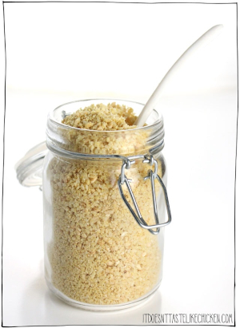

## Cashew-based Vegan Parmesan

[From the Fuss-Free Vegan Cookbook](https://www.amazon.ca/s?k=fuss+free+vegan&crid=2QXY700P3THUW&sprefix=fuss+fr%2Caps%2C-1&ref=nb_sb_ss_i_1_6)

** Prep time: 5 minutes || Serving: 1 cup || Rating X/10 **

### Ingredients

- 1/2 cup nutritional yeast
- 1/3 cashews (raw or roasted)
- 1/3 cup macadamia nuts
- 1/2 tsp salt

### Instructions

1. Place all ingredients in a food processor and blend until it reaches the desired texture (suggestion: rough sand, but finer is good, too).
1. Store in an air-tight container in the fridge for 1 month, or freeze.
