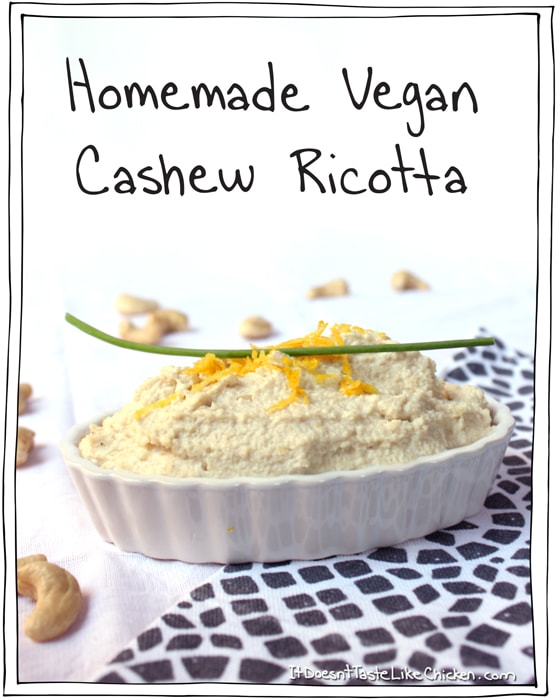

## Cashew-based Vegan Ricotta

[From the Fuss-Free Vegan Cookbook](https://www.amazon.ca/s?k=fuss+free+vegan&crid=2QXY700P3THUW&sprefix=fuss+fr%2Caps%2C-1&ref=nb_sb_ss_i_1_6)

** Prep time: 5 minutes || Serving: 1 1/2 cups || Rating X/10 **

### Ingredients

- 1 1/2 cups soaked, raw cashews
- 1 tsp lemon zest
- 1 Tbsp lemon juice
- 1 Tbsp nutritional yeast
- 1 tsp white miso paste
- 1 clove garlic
- 1/4 cup non-dairy milk
- 1/4 cup water (to reach desired consistency)

### Instructions

1. Place all ingredients in a food processor and blend until it reaches the desired consistency. Add additional water as needed.
1. Store in an air-tight container in the fridge for 1 week, or freeze.
