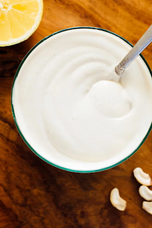

## Cashew-based Vegan Sour Cream

[From the Fuss-Free Vegan Cookbook](https://www.amazon.ca/s?k=fuss+free+vegan&crid=2QXY700P3THUW&sprefix=fuss+fr%2Caps%2C-1&ref=nb_sb_ss_i_1_6)

** Prep time: 5 minutes || Serving: 1 1/2 cups || Rating X/10 **

### Ingredients

- 1 cup soaked, raw cashews
- 1/2 cup water
- 1 Tbsp lemon juice
- 1 Tbsp apple cider vinegar
- 1 tsp white miso paste
- 1/2 tsp salt
### Instructions

1. Place all ingredients in a blender, and blend until very smooth.
1. Store in an air-tight container in the fridge for 1 week, or freeze.
