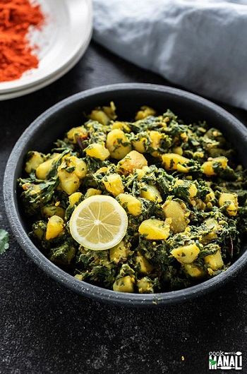

## Aloo Palak

[Original Recipe from Cook with Manali](https://www.cookwithmanali.com/aloo-palak/)

** Prep time: 10 minutes || Cook time: 20 minutes || Serving: 4 **

### Ingredients

- 2 teaspoons oil,(used olive oil)
- ½ teaspoon cumin seeds
- 5-6 large garlic cloves, chopped
- 3 dried red chilies, broken
- 1 small onion, chopped
- 2 medium potatoes, around 500 grams, cut into 1/2 inch pieces
- 1/4 teaspoon turmeric powder
- ½ teaspoon coriander powder
- 1/4 teaspoon red chili powder
- ½ + 1/8 teaspoon salt, or to taste
- 3 tablespoons water, as needed
- 12 oz spinach, finely chopped, around 5 to 6 cups finely chopped spinach
- 1/4 teaspoon garam masala
- ½ lemon, juiced

### Instructions

1. Heat oil in a large pan on medium heat. Once the oil is hot, add the cumin seeds and let them sizzle for few seconds.
2. Add chopped garlic and dried red chilies. Break the dried red chilies before adding to the pan for more heat.
3. Cook for 1 minutes until the garlic starts changing color. 
4. Add the chopped onion and cook until soft and translucentfor (about 3 minutes).
5. Stir in the chopped potatoes and mix.
6. Add turmeric, coriander, red chili powder, salt and 3 tablespoons water. Toss to combine until all the potatoes are well coated.
8. Close the pan with a lid and let potatoes cook, stirring every 2 minutes, until almost done on medium heat (about 6 to 7 minutes).
9. Start adding the chopped spinach slowly. Stir after each addition until the leaves wilt. Cook for 3 to 4 minutes.
10. Mix in garam masala and lemon juice. 

_Tags: Vegan, Gluten-free, indian, sides_