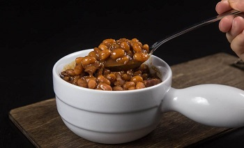

## Baked Beans - Instant Pot

[Original Recipe from Amy Jacky](https://www.pressurecookrecipes.com/instant-pot-baked-beans/)

** Prep time: 10 min || Cook time: 1 hour || Serving: 10 **

### Ingredients

Soak Navy Beans:

- 1 pound (454g) dried navy beans (soaked overnight for at least 8 - 16 hours, 889g after soaked)
- 1 ½ tablespoon (25g) fine table salt
- 6 cups (1.5L) cold water

Baked Beans Sauce & Aromatics:

- 6 strips (242g) thick cut bacon , roughly diced
- 1 (159g) small onion , roughly diced
- 2 (6g) garlic cloves , roughly chopped
- 1 ¾ cup (438ml) cold water
- ¼ cup (80g) blackstrap molasses
- ¼ cup (60g) maple syrup
- 1 tablespoon (15ml) light soy sauce (not low sodium soy sauce)
- ¼ teaspoon fine table salt
- 2 bay leaves
- Ground black pepper to taste
- 2 teaspoons (12g) dijon mustard
- 1 teaspoon (5ml) apple cider vinegar

### Instructions

1. Soak Navy Beans:

    - Overnight Soaking Method: Place 1 lb (454g) dried navy beans and 1 ½ tbsp (25g) fine table salt in a large container. Pour 6 cups (1.5L) cold water in the large container and give it a few stir. Allow beans to soak overnight for at least 8 - 16 hours. If your house is very warm, place the large container in the fridge to avoid fermentation.
   
    - Quick Soaking Method: If you're short on time or forgot to soak the beans overnight, you can use this quick soaking method instead. The result will not be as good as the overnight soaking method. Place 1 pound (454g) dried navy beans, 1.5 tbsp (25g) fine table salt, and 6 cups (1.5L) cold water in the pressure cooker. Close lid and pressure cook at High Pressure for 0 minute + 30 minutes Natural Release.

2. Drain Beans: Discard the soaked water and drain the navy beans through a mesh strainer. Rinse the beans with cold tap water. Drain well. The soaked beans should almost double in weight.
3. Render Bacon: Place chopped bacon in Pressure Cooker and turn heat to medium (Instant Pot: press Sauté button). Stir occasionally and allow the bacon bits to crisp (~3 mins). Add in diced onion, freshly ground black pepper and sauté for a minute. Add in chopped garlic cloves and sauté until fragrant (~30 seconds).
4. Create Molasses Mixture: While the bacon is rendering in pressure cooker, combine ¼ cup (80g) blackstrap molasses, ¼ cup (60g) maple syrup, 1 tbsp (15ml) light soy sauce, and 1 ¾ cup (438) cold water in a 1L (4 cups) glass measuring cup. Mix well.
5. Deglaze: Pour ½ cup (125ml) of the molasses mixture in the Instant Pot. Deglaze by scrubbing all the flavorful brown bits off the bottom of the pan and mix them into the mixture.
6. Pressure Cook Navy Beans: Add ¼ tsp fine table salt, 2 bay leaves, soaked navy beans (889g) and the remaining molasses mixture in the pressure cooker. Mix well and make sure all the beans are submerged in the molasses mixture. Close lid and pressure cook at High Pressure for 20 minutes + 20 minutes Natural Release. 

    **Important Tip: The pressure cooking time may vary depending on many factors such as the age of beans. If your beans are not fully cooked, simply add pressure cooking time accordingly. For reference, some readers reported their beans need to pressure cook for an extra 15 - 25 mins.**

7. After 20 minutes, turn the venting knob to venting position to release the remaining pressure. Open the lid carefully.
8. Season and Thicken Baked Beans: Add 2 tsp (12g) dijon mustard, and 1 tsp (5ml) apple cider vinegar into the cooked baked beans. Mix well. Turn heat to medium (Instant Pot: press Sauté button) and stir to thicken the baked beans to desired consistency. Taste and adjust the seasoning by adding more blackstrap molasses, salt, or vinegar if necessary. For reference, we added in another tbsp of blackstrap molasses.

