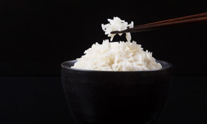

## Coconut Rice

[Original Recipe by Amy and Jacky](https://www.pressurecookrecipes.com/instant-pot-coconut-rice/)

** Prep time: 1 minute || Cook time: 25 minutes || Serving: 2-4 || Rating 9/10 **

### Ingredients

- 1 cup (230g) Jasmine rice
- 1/2 cup (125ml) 100% pure unsweetened coconut milk
- 3/4 cup (188ml) broth
- 1/4 to 1/2 teaspoon salt

### Instructions

1. In the pressure cooker add the coconut milk and broth. Give it a quick mix. 
2. Add the rice and ensure all the rice is covered in liquid. 
3. Close the lid and pressure cook at High Pressure using Manual/Pressure Cook button for 5 minutes + 10 minutes Natural Release.

Serve: Fluff the Coconut Rice and serve with your favourite main dish.

