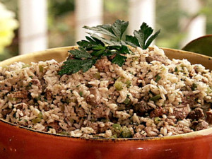

## Dirty Rice

** Prep time: 15 minutes || Cook time: 40 minutes || Serving: 6 || Rating 9.5/10 **

### Ingredients

- 8 ounces chicken livers
- 2 cups of uncooked long grain rice
- 4 cups bone broth
- 1 green bell pepper, diced
- 1 onion, diced
- 1 stalk celery, diced
- 2 tablespoons olive oil
- 1 spoonful Louisiana spice blend
- salt and pepper.

#### Homemade Louisiana spice blend:

- 3 tablespoons paprika
- 2 tablespoons onion powder
- 2 tablespoons garlic powder
- 2 tablespoons dried oregano
- 2 tablespoons dried thyme
- 2 tablespoons sassafras (gumbo file powder)
- 1 tablespoon of cayenne pepper

Mix well and store in a tightly sealed jar.

### Instructions

1. Preheat a heavy saucepot over medium high heat. Add olive oil. 
2. Add chicken livers and saute as they begin to brown. Breaking them up with a wooden spoon. Continue to brown and mince them for about 15 minutes.
3. When all the liquid has evaporated and the chicken livers are browned and "dirty", add the bell peppers, onion and celery. Stir well until the vegetable are a bit soften. 
4. Add the rice and broth. Season with salt and spice blend and bring to a simmer. Cover with a tight fitting lid, turn the heat to low and cook until all the liquid has been absorbed and the rice is tender. 

A fantastic dish to go with [Gumbo](../main_course/gumbo.md)!

